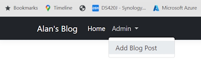

# Creating our Blog Post web page and Actions

## _Layout.cshtml

We will create a Black Navbar for all of the pages.

```bash
   <header>
       <nav class="navbar navbar-expand-sm navbar-toggleable-sm navbar-dark bg-dark border-bottom box-shadow mb-3">
```

In the Navbar we have added ``navbar-dark`` and ``bg-dark``.

We also change the two other menu items to ``text-white`` so that we can see them.

```bash
<li class="nav-item">
    <a class="nav-link text-white" asp-area="" asp-page="/Index">Home</a>
</li>
<li class="nav-item">
    <a class="nav-link text-white" asp-area="" asp-page="/Privacy">Privacy</a>
</li>
```

The Navbar now looks like this.


## Creating a new Page for Blog Posts

This is an Admin page so we will create the folder structure ``Admin-->Blogs`` in the ``Pages`` folder.

Add a new Empty Razor page named ``Add`` which will be used to create a new Blog Post.

These are the two templates that are built for you.

### Add.cshtml

```bash
    @page
    @model Blog.Pages.Admin.Blogs.AddModel
    @{
    }
```

### Add.cshtml.cs

```bash
    using Microsoft.AspNetCore.Mvc;
    using Microsoft.AspNetCore.Mvc.RazorPages;

    namespace Blog.Pages.Admin.Blogs
    {
        public class AddModel : PageModel
        {
            public void OnGet()
            {
            }
        }
    }
```

We can navigate to this page with.

> <https://localhost:7100/admin/blogs/add>

Go back to the ``_layout.cs`` page and add an Admin section to the menu.

```bash
<li class="nav-item dropdown">
    <a class="nav-link dropdown-toggle" href="#" role="button" data-bs-toggle="dropdown" 
        aria-expanded="false" id="navbarDropdownAdmin">
        Admin
    </a>
    <ul class="dropdown-menu">
        <li>
            <a class="dropdown-item" href="/admin/blogs/add">Add Blog Post</a>
        </li>
    </ul>
</li>
```

This will look like.



Make another small change to the ``_layout.cs`` page. Remove the Container class div from around ``main``.

```bash
    </header>
    <main role="main" class="pb-3">
        @RenderBody()
    </main>

    <footer class="border-top footer text-muted">
```

### Create an Add Blog Post Razor form and Bind property

``Add.cshtml``

```bash
@page
@model Blog.Pages.Admin.Blogs.AddModel
@{
}

<div class="bg-secondary bg-opacity-10 py-2 mb-5">
    <div class="container">
        <h2>Add Blog page</h2> 
    </div>
</div>

<div>
    <div class="container">
        <form method="post">
            <div class="mb-3">
                <label for="heading" class="form-label">Heading</label>
                <input type="text" required class="form-control" id="heading" name="heading">
            </div>

            <div class="mb-3">
                <label for="pageTitle" class="form-label">Page Title</label>
                <input type="text" required class="form-control" id="pageTitle" name="pageTitle">
            </div>

            <div class="mb-3">
                <label for="content" class="form-label">Content</label>
                <textarea class="form-control" required id="content" name="content"></textarea>
            </div>

            <div class="mb-3">
                <label for="shortDescription" class="form-label">Short Description</label>
                <input type="text" required class="form-control" id="shortDescription" name="shortDescription">
            </div>

            <div class="mb-3">
                <label for="featuredImageUrl" class="form-label">Featured Image Url</label>
                <input type="text" required class="form-control" id="featuredImageUrl" name="featuredImageUrl">
            </div>

            <div class="mb-3">
                <label for="urlHandle" class="form-label">Url Handle</label>
                <input type="text" required class="form-control" id="urlHandle" name="urlHandle">
            </div>

            <div class="mb-3">
                <label for="publishedDate" class="form-label">Published Date</label>
                <input type="date" required class="form-control" id="publishedDate" name="publishedDate">
            </div>

            <div class="mb-3">
                <label for="author" class="form-label">Author</label>
                <input type="text" required class="form-control" id="author" name="author">
            </div>

            <div class="form-check mb-3">
                <input class="form-check-input" type="checkbox" id="isVisible" name="isVisible">
                <label class="form-check-label" for="isVisible">
                    Is Visible
                </label>
            </div>

            <div class="mb-3">
                <button class="btn btn-primary" type="submit">Submit</button>
            </div>
        </form>
    </div>
</div>
```

In our CodeBehind page we have an ``OnGet()`` method and we also need an ``OnPost()`` method.

There are a number of ways that we can get the data from the Form to the ``OnPost()`` method.

We have added the ``name`` attribute to each field and will use this to retrieve the data in the CodeBehind page.

```bash
    public void OnPost()
    {
        var heading = Request.Form["heading"];
        var pageTitle = Request.Form["pageTitle"];
        var content = Request.Form["content"];
        var shortDescription = Request.Form["shortDescription"];
        var featuredImageUpload = Request.Form["featuredImageUpload"];
        var featuredImageUrl = Request.Form["featuredImageUrl"];
        var urlHandle = Request.Form["urlHandle"];
        var publishedDate = Request.Form["publishedDate"];
        var author = Request.Form["author"];
        var tags = Request.Form["tags"];
        var isVisible = Request.Form["isVisible"];
    }
```

This is the old way of returning data. it grabs the ``name`` field from the form.

A slightly better way is to add properties to the CodeBehind page. First you need to change all of the ``name`` attributes on the ``Add.cshtml`` page to ``asp-for`` tag helpers. E.g.

```bash
    <input type="text" required class="form-control" id="heading" asp-for="Heading">
```

In the ``Add.cshtml.cs`` CodeBehind.

```bash
    [BindProperty]
    public string Heading { get; set; }
    
    [BindProperty]
    public string PageTitle { get; set; }
```

In the ``OnPost()`` method you can call these properties to get their values once you Post the ``Add`` page.

```bash
    public void OnPost()
    {
        var heading = Heading;
        var pageTitle = PageTitle;
    }
```

This method will clutter up the CodeBehind class. A much better idea is to create a ViewModel. We do this by creating a ``ViewModels`` folder inside the ``Models`` folder.

Now create a class named ``AddBlogPost.cs`` in ``ViewModels``.

```bash
    public class AddBlogPost
    {
        [Required]
        public string Heading { get; set; }

        [Required]
        public string PageTitle { get; set; }

        [Required]
        public string Content { get; set; }

        [Required]
        public string ShortDescription { get; set; }

        [Required]
        public string FeaturedImageUrl { get; set; }

        [Required]
        public string UrlHandle { get; set; }

        [Required]
        public DateTime PublishedDate { get; set; }

        [Required]
        public string Author { get; set; }

        public bool Visible { get; set; }
    }
```

Now we have to change the ``Add.cshtml`` page.

```bash
@page
@model Blog.Pages.Admin.Blogs.AddModel
@{
}

<div class="bg-secondary bg-opacity-10 py-2 mb-5">
    <div class="container">
        <h2>Add Blog page</h2> 
    </div>
</div>

<div>
    <div class="container">
        <form method="post">
            <div class="mb-3">
                <label for="heading" class="form-label">Heading</label>
                <input type="text" class="form-control" id="heading" asp-for="AddBlogPostRequest.Heading">
            </div>

            <div class="mb-3">
                <label for="pageTitle" class="form-label">Page Title</label>
                <input type="text" class="form-control" id="pageTitle" asp-for="AddBlogPostRequest.PageTitle">
            </div>

            <div class="mb-3">
                <label for="content" class="form-label">Content</label>
                <textarea class="form-control" id="content" asp-for="AddBlogPostRequest.Content"></textarea>
            </div>

            <div class="mb-3">
                <label for="shortDescription" class="form-label">Short Description</label>
                <input type="text" class="form-control" id="shortDescription" asp-for="AddBlogPostRequest.ShortDescription">
            </div>

             <div class="mb-3">
                <label for="featuredImageUrl" class="form-label">Featured Image Url</label>
                <input type="text" class="form-control" id="featuredImageUrl" asp-for="AddBlogPostRequest.FeaturedImageUrl">
            </div>

            <div class="mb-3">
                <label for="urlHandle" class="form-label">Url Handle</label>
                <input type="text" class="form-control" id="urlHandle" asp-for="AddBlogPostRequest.UrlHandle">
            </div>

            <div class="mb-3">
                <label for="publishedDate" class="form-label">Published Date</label>
                <input type="date" class="form-control" id="publishedDate" asp-for="AddBlogPostRequest.PublishedDate">
            </div>

            <div class="mb-3">
                <label for="author" class="form-label">Author</label>
                <input type="text" class="form-control" id="author" asp-for="AddBlogPostRequest.Author">
            </div>

            <div class="form-check mb-3">
                <input class="form-check-input" type="checkbox" id="isVisible" asp-for="AddBlogPostRequest.Visible">
                <label class="form-check-label" for="isVisible">
                    Is Visible
                </label>
            </div>

            <div class="mb-3">
                <button class="btn btn-primary" type="submit">Submit</button>
            </div>
        </form>
    </div>
</div>
```
