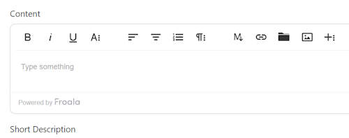
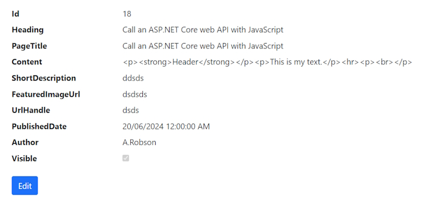

# 05-Adding an Editor and Image Upload

## Adding an Editor to our Add and Edit page
 
We are going to use ``Froala`` editor.

### Installing Froala editor

[Install Froala link.](https://froala.com/wysiwyg-editor/docs/overview/)

Click on ``Get Started`` link.

Select ``Choose Your Framework`` and select CDN. This will give you 2 links that you can add to ``_layout.cs``. Add these in the ``head`` section of your page.

```bash
<link href='https://cdn.jsdelivr.net/npm/froala-editor@latest/css/froala_editor.pkgd.min.css' rel='stylesheet' type='text/css' />

<script type='text/javascript' src='https://cdn.jsdelivr.net/npm/froala-editor@latest/js/froala_editor.pkgd.min.js'></script>
```

In the ``Add()`` page we are going add the text editor to the Content ``TextArea`` which has an id of ``"content"``.

At the bottom of the page we will add this script section.

```bash
    @section Scripts {
        <script>
            var editor = new FroalaEditor('#content');
        </script>
    }
```

When we open the ``Add()`` View Page we will see this.



Now we can add rich text and Froala text editor will turn it into Html code.

Som sample content.



We can add the same script section to our Edit View Page as it also has an Id of ``"content"``.

## Adding an Image Upload to our application

We need to create an Image Upload API to our project.

Create a ``Controllers`` folder.

Add a new Controller into your folder using the MVC Empty template. Name it ``ImagesController.cs``.

Add the ``ApiController`` attribute to the Controller class. 

```bash
    [ApiController]
    public class ImagesController : Controller
    {
        public IActionResult Index()
        {
            return View();
        }
    }
```

This specifies that the Controller is an ``ApiController`` and doesn't have any views and all that it is doing is returning some data or performing an Action.

Now we need to add some routing. We will be adding a ``Get()`` method and  ``Post()`` method.

We will add routing to the Controller method.

```bash
    [ApiController]
    [Route("api/images")]
    public class ImagesController : Controller
    {
        public IActionResult Index()
        {
            return View();
        }
    }
```

The Controller can also be used in the Route with this line.

> [Route("api/[controller]")]

Which is the same as above.

The ``Get()`` method won't be used but we will create one for testing.

```bash
    [HttpGet]
    public IActionResult Index()
    {
        return Ok("This is the Images Get() method!");
    }
```

 **Note:** the ``HttpGet`` attribute lets you know that ``Index()`` is a **GET** method. We could also call the method ``Get()``.

In order to use any method in our API Controller we will have to change ``Program.cs`` to configure it to work with Razor pages.

Add the following line after ``AddRazorPages()``.

```bash
    // Add services to the container.
    builder.Services.AddRazorPages();

    builder.Services.AddControllers();
```

**Note:** there is also a ``builder.Services.AddControllersWithViews();`` but we aren't interested thin creating views in this application.

This injects our Controller into the Services.

Next we need to configure the Controller inside the Http Request pipeline.

```bash
    app.MapRazorPages();
    app.MapControllers();
```

Now with these 2 changes we should be able to hit the ``Get()`` method inside our Controller.

Let's try it out.

> <https://localhost:7100/api/images>

Returns.

 Api method")

This shows that the **GET** request is working.

## Create the Post method

```bash
    [HttpPost]
    //[Route("Upload")]
    public async Task<IActionResult> UploadAsync(IFormFile file)
    {
        
    }
```

Now we need to create

## Create POST method and Image Repository

Create your Interface first.

### IImageRepository

```bash
    public interface IIimageRepository
    {
        Task<Image> UploadAsync(IFormFile file);
    }
```

Now create the implementation.

### ImageRepository.cs

```bash
    public class ImageRepository: IImageRepository
    {
        public async Task<string> UploadAsync(IFormFile file)
        {

        }
    }
```

## Create a Cloundinary account

We can create an account on [Cloudinary](https://cloundinary.com).

Create a new API key

Install:

> Install-Package CloundaryDotNet

### appsettings.json

Add this section after the connection strings.

```bash
    "Cloudinary": {
      "CloudName": "cloud name",
      "ApiKey": "key",
      "ApiSecret": "secret"
    }
```

Add a constructor into ``ImageRepository``.

```bash
    private readonly Account account;

    public ImageRepository(IConfiguration configuration)
    {
        account = new Account(configuration.GetSection("Cloudinary")["CloudName"],
            configuration.GetSection("Cloudinary")["ApiKey"],
            configuration.GetSection("Cloudinary")["ApiSecret"]);
    }
```

This contains our Cloudinary details.

Now we can finish off our ``UploadAsync()`` method in our ``ImagesRepository``.

```bash
    public async Task<string> UploadAsync(IFormFile file)
    {
        var client = new Cloudinary(account);
        var result = await client.UploadAsync(
            new CloudinaryDotNet.Actions.ImageUploadParams()
            {
                File = new FileDescription(file.FileName, file.OpenReadStream()),
                DisplayName = file.FileName
            });

        if (result != null && result.StatusCode == System.Net.HttpStatusCode.OK) 
        {
            return result.SecureUrl.ToString();
        }

        return null;
    }
```

## Inject our Image Repository and test Cloudinary

First we have to inject our ``ImageRepository`` into our application.

In ``Program.cs`` add the following line below the ``BlogRepository`` injection.

> ``builder.Services.AddScoped<IImageRepository, ImageRepository>();``

Now we can inject our ``ImageRepository`` into our ``ImagesController``. First create a constructor to inject our ``ImageRepository``.

```bash
    private readonly IImageRepository imageRepository;

    public ImagesController(IImageRepository imageRepository)
    {
        this.imageRepository = imageRepository;
    }
```

Now create our ``UploadAsync()`` **POST** method.

```bash
[HttpPost]
public async Task<IActionResult> UploadAsync(IFormFile file)
{

    // User repository to upload image
    var imageUrl = await imageRepository.UploadAsync(file);

    if (imageUrl == null)
    {
        return Problem("An Error occured!", null, (int)HttpStatusCode.InternalServerError);
    }

    return Json(new { link = imageUrl });
}
```

Use **Postman** to test the ``POST`` method

Url:

> [https://localhost:7100/api/images](https://localhost:7100/api/images)
