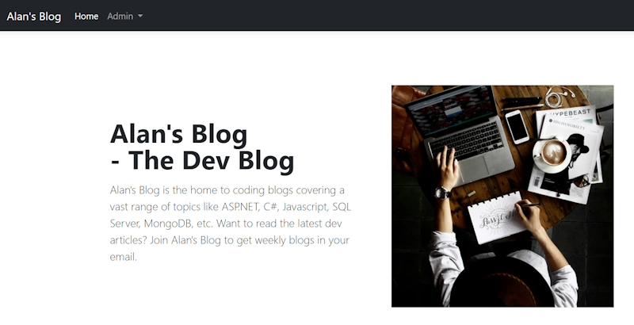

# Displaying Blogs and Tags

## Index page

The first thing we will do is build an ``Index.cshtml`` page that will show a Hero block and a list of Blogs.

### Index.cshtml

```bash
@page
@model IndexModel
@{
    ViewData["Title"] = "Home page";
}


<div class="container col-xxl-8 px-4 py-5">
    <div class="row align-items-center g-5 py-5">
        <div class="col-12 col-lg-6">
            <h1 class="display-5 fw-bold lh-1 mb-3">
                Alan's Blog<br/>- The Dev Blog
            </h1>
            <p class="lead">
                Alan's Blog is the home to coding blogs covering a vast range of topics like ASP.NET, C#, Javascript, SQL Server, MongoDB, etc. Want to read the latest dev articles? Join Alan's Blog to get weekly blogs in your email.
            </p>
        </div>
        <div class="col-12 col-lg-6">
            
        </div>
    </div>
</div>

<div class="container">
    <div class="row justify-content-center">
        <div class="col-6">

            <h2 class="mb-5 display-3">Blogs</h2>

            @if (Model.Blogs != null && Model.Blogs.Any())
            {
                foreach (var blog in Model.Blogs)
                {
                    <div class="mb-5 bg-light box-shadow">
                        
                        <div class="px-4 py-4">
                            <h2 class="mb-2">@blog.Heading.ToProperCase()</h2>
                            <p>
                                Author: @blog.Author
                                <br />
                                Date Published: @blog.PublishedDate.ToShortDateString()
                            </p>
                            <p class="mb-2">@blog.ShortDescription</p>
                            <a href="/blog/@blog.UrlHandle" class="btn btn-dark">Read More</a>
                        </div>
                    </div>
                }
            }
        </div>
    </div>
</div>
```

### Index.cshtml.cs

```bash
    private readonly ILogger<IndexModel> _logger;
    public IBlogPostRepository blogPostRepository { get; }

    public List<BlogPost> Blogs { get; set; }

    public IndexModel(ILogger<IndexModel> logger, IBlogPostRepository blogPostRepository)
    {
        _logger = logger;
        this.blogPostRepository = blogPostRepository;
    }

    public async Task<IActionResult> OnGet()
    {
        Blogs = (await blogPostRepository.GetAllAsync()).ToList();

        return Page();
    }
```

## Create a ToProperCase class

A number of headers contain uppercase words. The easy way would be to write them in the proper case in the first place.

Another way is to build a proper case string extension class.

First we have to add a line to ``_ViewImports.cshtml``.

```bash
    @using Blog.Models
```

We are going to add a class into the Models folder named ``StringExtensions.cs``.

```bash
    public static string ToProperCase(this string str)
    {
        if (string.IsNullOrWhiteSpace(str))
            return str;

        var words = str.Split(' ');
        for (int i = 0; i < words.Length; i++)
        {
            if (words[i].Length > 0)
            {
                words[i] = char.ToUpper(words[i][0]) + words[i].Substring(1).ToLower();
            }
        }

        var header = string.Join(" ", words);

        header = ProperCaseWords(header);

        return header;
    }

    private static string ProperCaseWords(string header)
    {
        var replacements = new Dictionary<string, string>(StringComparer.OrdinalIgnoreCase)
        {
            { "Javascript", "JavaScript" },
            { "Typescript", "TypeScript" },
            { "Mongodb", "MongoDB" },
            { "Asp.net", "ASP.NET" },
            { "Sms", "SMS" },
            { "Sql", "SQL" }
        };

        foreach (var replacement in replacements)
        {
            header = header.Replace(replacement.Key, replacement.Value, StringComparison.OrdinalIgnoreCase);
        }

        return header;
    }
```

``ToProperCase()`` will proper case the headers but words like JavaScript will become Javascript which is not the proper case. To get around this I have built another method named ``ProperCaseWords()`` to correctly case particular words.

This is what the final page looks like.



If you scroll down the page you will see the Blogs section.


## Displaying Blog details

We need to display the details of a Blog Post. To do this we will create a folder named ``BlogPage`` in the root of the ``Pages`` folder.

**Note:** I originally called the folder ``Blog`` but this conflicted with the name of the application. I need to be aware of this in other projects.

From here create a ``Details.cshtml`` Razor page.

We don't want to serve this page using the default routing. We need to take advantage of SEO to allow robots to find our content. We need to capture the Url handle of the Blog Post which is a search engine readable form of the blog. So we will override our existing route handling and create a different routing for this page.

We can do this by adding our route to the ``@page`` declaration.

```bash
    @page "/blog/details"
```

This is all we have to do to change the routing.

We need to make one more change to use the ``urlHandle`` from the BlogPost entity.

```bash
    @page "/blog/{urlHandle}"
```

Now the route will use the ``urlHandle`` field in the ``BlogPost`` table. Note that these are unique and are now human readable and search engine friendly.

For example we can search for this Url.

> <https://localhost:7100/blog/twilio-sms-api-tutorial-using-c-sharp-dot-net>

It doesn't return much content at present but will work. We need to be able to build the page content from a single BlogPost entity.

To retrieve the content for our Blog Post we need to add the ``urlHandle`` to our ``OnGet()`` method in the Code Behind page.

The next thing we need to do is change our ``Read more`` button on our ``Index.cshtml`` page so that it uses the ``urlHandle`` property.

```bash
    <a href="/blog/@blog.UrlHandle" class="btn btn-dark">Read more</a>
```

Now we can work on getting our Blog Post. We have a ``GetAsync()`` method in our ``BlogPostRepository`` but it wants an ``id`` parameter so this wont work. We need to create a new method that requires a string parameter for ``urlHandle``.

In ``IBlogRepository`` add.

```bash
    Task<BlogPost> GetAsync(string urlHandle);
```

In ``BlogPostRepository``.

```bash
    public async Task<BlogPost> GetAsync(string urlHandle)
    {
        return await blogDbContext.BlogPosts.FirstOrDefaultAsync(x => x.UrlHandle == urlHandle);
    }
```

Now back in ``Details.cshtml.cs``.
