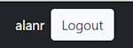

# Adding Login and Registration Using Microsoft Identity

## Install

> Microsoft.AspNetCore.Identity.EntityFrameworkCore

Create a new ``AuthDbContext`` class in ``Data`` that inherits from ``IdentityDbContext``.

```bash
    public class AuthDbContext: IdentityDbContext
    {
    }
```

We will create seed data in the following method.

```bash
    protected override void OnModelCreating(ModelBuilder builder)
    {
    }
```

## Add Connection String and Injecting DbContext Into Program.cs

In ``appsettings.json`` add a connection string.

```bash
    "AuthDb": "Server=TIGER;Database=BlogAuth;Trusted_Connection=True;TrustServerCertificate=True;"
```

Inject the connection string into ``Program.cs``. We also need to tell our application to use Identity and use the ``AuthDbContext`` for our Identity. We will do another injection to add an Identity. We also have to add an Entity Framework store with a type of ``AuthDbContext``.

```bash
    builder.Services.AddDbContext<AuthDbContext>(options =>
        options.UseSqlServer(builder.Configuration.GetConnectionString("AuthDb")));

    builder.Services.AddIdentity<IdentityUser, IdentityRole>()
        .AddEntityFrameworkStores<AuthDbContext>();
```

Change the Http Request pipeline. Before we can use ``Authorization`` we have to use ``Authentication``.

```bash
    app.UseAuthentication();
```

We are now ready to go with using Identity.

## Running Entity Framework Core migrations

In Package Manager console.

```bash
    Add-Migration "Adding Identity." -Context "AuthDbContext"
```

**Note:** we have to specify the context we are using because there are two contexts.

To create the database.

```bash
    Update-Database -Context "AuthDbContext"
```

Once again we have to specify the context we are using.

## Implement a User page

Create a new ``Register`` class.

```bash
    [Required]
    public string Username { get; set; }

    [Required]
    [EmailAddress]
    public string Email { get; set; }

    [Required]
    [MinLength(6)]
    public string Password { get; set; }
```

Create a new Razor page in to root of ``Pages`` named ``Register``.

```bash
<div class="container mx-auto">
    <div class="row justify-content-center">
        <div class="col-12 col-lg-6">

            <h1 class="mt-5 mb-3 h3">Register</h1>

            <partial name="_Notification">

                <form method="post">

                    <div class="mb-3">
                        <label class="form-label">Username</label>
                        <input type="text" class="form-control" asp-for="RegisterViewModel.Username" required />
                    </div>

                    <div class="mb-3">
                        <label class="form-label">Email</label>
                        <input type="email" class="form-control" asp-for="RegisterViewModel.Email" required />
                    </div>

                    <div class="mb-3">
                        <label class="form-label">Password</label>
                        <input type="password" class="form-control" asp-for="RegisterViewModel.Password" required minlength="6" />
                    </div>

                    <div class="mb-3">
                        <button type="submit" class="btn bg-dark text-light">Register</button>
                    </div>

                </form>
        </div>
    </div>
</div>
```

Now create a constructor in the Code Behind class and a bindable ``Register`` instance.

```bash
    [BindProperty]
    public Register RegisterViewModel { get; set; }

    private readonly UserManager<IdentityUser> userManager;
    
    public RegisterModel(UserManager<IdentityUser> userManager)
    {
        this.userManager = userManager;
    }
```

Create the ``OnPost()`` method.

```bash
    public async Task<IActionResult> OnPost()
    {
        var user = new IdentityUser
        {
            UserName = RegisterViewModel.Username,
            Email = RegisterViewModel.Email
        };

        var result = await userManager.CreateAsync(user, RegisterViewModel.Password);

        if (result.Succeeded)
        {
            ViewData["Notification"] = new Notification
            {
                Type = Enums.NotificationType.Success,
                Message = "User registered successfully!"
            };

            return Page();
        }

        ViewData["Notification"] = new Notification
        {
            Type = Enums.NotificationType.Error,
            Message = "User NOT registered!"
        };

        return Page();
    }
```

We need to add the partial view, ``_Notification.cshtml`` to the top of our ``Register`` page.

```bash
    <h1 class="mt-5 mb-3 h3">Register</h1>
    
    <partial name="_Notification">
```

When we run the application we get a ``System.InvalidOperationException`` error caused by the DbContexts.

## Handling multiple DbContexts

We get the error here.

```bash
    public BlogDbContext(DbContextOptions options) : base(options)
    {
    }
```

Now that we have two DbContexts we have to name which context we are using.

```bash
    public BlogDbContext(DbContextOptions<BlogDbContext> options) : base(options)
    {
    }
```

Do this with the ``AuthDbContext`` as well.

```bash
    public AuthDbContext(DbContextOptions<AuthDbContext> options) : base(options)
    {
    }
```

## Testing Register functionality

I create a new user and get an error. Identity has requirements for creating a new User password.

We can change these requirements in ``Program.cs`` by adding a new Services configuration option.

```bash
    builder.Services.Configure<IdentityOptions>(options =>
    {
        // Default password settings
        options.Password.RequireDigit = true;
        options.Password.RequireNonAlphanumeric = true;
        options.Password.RequireUppercase = false;
        options.Password.RequiredLength = 6;
    });
```

Change menu items on the ``Layout.cshtml`` page.

Under the ``ul`` with a class of "navbar-nav flex-grow-1" add the following section.

```bash
    ...
    </ul>
    <div class="d-flex">
        <a href="/login" class="btn btn-light text-dark me-3">Login</a>
        <a href="/register" class="btn btn-light text-dark me-3">Register</a>
    </div>
```

This adds ``Login`` and ``Register`` buttons.

## Implement the Login page and functionality

Create a Razor class form named ``Login``.

```bash
<div class="container mx-auto">
    <div class="row justify-content-center">
        <div class="col-12 col-lg-6">

            <h1 class="mt-5 mb-3 h3">Login</h1>

            <partial name="_Notification">

                <form method="post">

                    <div class="mb-3">
                        <label class="form-label">Username</label>
                        <input type="text" class="form-control" asp-for="LoginViewModel.Username" required />
                    </div>

                    <div class="mb-3">
                        <label class="form-label">Password</label>
                        <input type="password" class="form-control" asp-for="LoginViewModel.Password" required minlength="6" />
                    </div>

                    <div class="mb-3">
                        <button type="submit" class="btn bg-dark text-light">Login</button>
                    </div>

                </form>
        </div>
    </div>
</div>
```

### Login.cshtml.cs

```bash
    private readonly SignInManager<IdentityUser> signInManager;
    
    [BindProperty]
    public Login LoginViewModel { get; set; }
    
    public LoginModel(SignInManager<IdentityUser> signInManager)
    {
        this.signInManager = signInManager;
    }
    
    public async Task<IActionResult> OnPost(string? ReturnUrl)
    {
        if (ModelState.IsValid)
        {
            var signInResult = await signInManager.PasswordSignInAsync(
            LoginViewModel.Username, LoginViewModel.Password, false, false);

            if (signInResult.Succeeded)
            {
                if (!string.IsNullOrWhiteSpace(ReturnUrl))
                {
                    return RedirectToPage(ReturnUrl);
                }
            
                return RedirectToPage("Index");
            }
            else
            {
                ViewData["Notification"] = new Notification
                {
                    Type = Enums.NotificationType.Error,
                    Message = "Unable to login"
                };
            
                return Page();
            }
        }

        return Page();
    }
```

We use ASP.NET Core's SignIn Identity management to login.

In _Layout.cshtml we need to add the SignIn Identity. At the top of the page.

```bash
    @using Microsoft.AspNetCore.Identity
    @inject SignInManager<IdentityUser> signInManager
```

Now we need to change the Login button code.

```bash
    <div class="d-flex align-items-center text-light">
        @if (signInManager.IsSignedIn(User))
        {
            <div class="me-2">
                @User?.Identity?.Name
            </div>

            <a href="/logout" class="btn btn-light text-dark me-3">Logout</a>
        }
        else
        {
            <a href="/login" class="btn btn-light text-dark me-3">Login</a>
            <a href="/register" class="btn btn-light text-dark me-3">Register</a>
        }
    </div>
```

This will change the Login button layout so that if we are logged in we will only see the Logout button and the users name. If we aren't logged in we will see the Login and Register buttons.

The logged in button view.



## Implement Logout functionality
