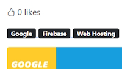

# Adding User Functionality with Likes and Comments

## Domain Model for Blog Post Likes

Create a new Domain Model named ``BlogPostLike``.

```bash
    public class BlogPostLike
    {
        public int Id { get; set; }
        public int BlogPostId { get; set; }
        public int UserId { get; set; }
    }
```

In the ``BlogPost`` Domain Model add a new navigation property.

```bash
    public ICollection<BlogPostLike> Likes { get; set; }
```

In The ``BlogDbContext.cs`` file add.

```bash
    public DbSet<BlogPostLike> BlogPostLike { get; set; }
```

Do a new migration.

> Add-Migration "Add BlogPostLike domain model." -Context BlogDbContext

Now create the Likes table in the database.

> Update-Database -Context BlogDbContext

## Implement the total Likes on Blog Details

Install Bootstrap icons.
[Get bootstrap Icons](https://icons.getbootstrap.com/#install)

Add the CDN link to our ``_Layout.cshtml`` page in the header section.

```bash
<link rel="stylesheet" href="https://cdn.jsdelivr.net/npm/bootstrap-icons@1.11.3/font/bootstrap-icons.min.css">
```

We want to use a thumbs up icon on our ``Details`` page. Find it on the Icons main page.

```bash
    <i class="bi bi-hand-thumbs-up"></i>
```

Add it to a new Div on our page. We will add a number of likes.

```bash
    <div class="mb-3">
        <span><i class="bi bi-hand-thumbs-up"></i> 60 likes</span>
    </div>
```

It looks like this.


There are a number of things we need to do.

* Make the icon into a workable button to collect the ``click`` event.
* Get the number of likes from the database
* Save the collected like to the database

Now in the Code Behind class we will get the number of likes for an article from the database. First we need to create a ``IBlogPostLikeRepository`` interface in the Repository and an implementation class ``LikeRepository``.

Add our first method into our ``IBlogPostLikeRepository`` interface.

```bash
    public interface IBlogPostLikeRepository
    {
        Task<int> GetPostTotalLikes(int blogPostId);
    }
```

Create an implementation of our interface method.

We also need a context to the database and to inject the services into our application.

In ``Program.cs`` add.

```bash
    builder.Services.AddScoped<IBlogPostLikeRepository, BlogPostLikeRepository>();
```

Add your context to the ``BlogPostLikeRepository`` constructor and create your method implementation.

```bash
    private readonly BlogDbContext blogDbContext;

    public BlogPostLikeRepository(BlogDbContext blogDbContext)
    {
        this.blogDbContext = blogDbContext;
    }

    public async Task<int> GetTotalLikesForBlog(int blogPostId)
    {
        return await blogDbContext.BlogPostLike.CountAsync(x => x.BlogPostId == blogPostId);
    }
```

We can now use this repository in our ``BlogPage\Details`` Code Behind class.

Inject the ``IBlogPostLikeRepository`` into our constructor. Add the number of likes for our Blog Post in the ``OnGet()`` method.

Create a new public property to store the likes named ``TotalLikes``.

### BlogPage/Details.cshtml.cs

```bash
private readonly IBlogPostRepository blogPostRepository;
private readonly IBlogPostLikeRepository blogPostLikeRepository;

public int TotalLikes { get; set; }
public BlogPost BlogPost { get; set; }

public DetailsModel(IBlogPostRepository blogPostRepository, IBlogPostLikeRepository blogPostLikeRepository)
{
    this.blogPostRepository = blogPostRepository;
    this.blogPostLikeRepository = blogPostLikeRepository;
}

public async Task<IActionResult> OnGet(string urlHandle)
{
    BlogPost = await blogPostRepository.GetAsync(urlHandle);

    if (BlogPost != null) 
    {
        TotalLikes = await likeRepository.GetPostTotalLikes(BlogPost.Id);
    }
    
    return Page();
}
```

We can now use ``TotalLikes`` in our ``Details`` page.

```bash
    <span><i class="bi bi-hand-thumbs-up"></i> @Model.TotalLikes likes</span>
```

This should give us the total number of likes which will be 0 because we haven't added any likes yet.



## Adding a like to a Blog Post

We will add an anchor element as a button to our like span.

```bash
    <span>
        <a id="btnLike" style="cursor: pointer">
            <i class="bi bi-hand-thumbs-up"></i>
        </a>
        @Model.TotalLikes likes
    </span>
```

Now we can add some JavaScript to save the ``click`` event to write the result to our database. To do this we will create a new Controller named ``BlogPostLikeController``. We will also create a new ViewModel named ``AddLike``.

### ViewModel/AddBlogPostLikeRequest.cs

```bash
    public int BlogPostId { get; set; }
    public Guid UserId { get; set; }
```

### BlogPostLikeController.cs

Add an ApiController attribute to state that this Controller doesn't have any views.

Add a route for ``api/blogpostlike``.

```bash
    [ApiController]
    [Route("api/[controller]")]
    public class BlogPostLikeController : Controller
    {
        [Route("Add")]
        [HttpPost]
        public Task<IActionResult> AddLike([FromBody] AddLike addLike)
        {

        }
    }
```

After doing this our route will be, ``api/blogpostlike/add``.

At this stage we will have to add a new method named ``AddLikeForBlog`` to our ``BlogPostLikeRepository``.

```bash
    public async Task AddLikeForBlog(int blogPostId, Guid userId)
    {
        var like = new BlogPostLike
        {
            BlogPostId = blogPostId,
            UserId = userId
        };

        await blogDbContext.BlogPostLike.AddAsync(like);
        await blogDbContext.SaveChangesAsync();
    }
```

Use this method in ``BlogPostLikeController``.

```bash
    [Route("Add")]
    [HttpPost]
    public async Task<IActionResult> AddLike([FromBody] AddBlogPostLikeRequest addLike)
    {
        await likeRepository.AddLikeForBlog(addLike.BlogPostId, addLike.UserId);

        return Ok();
    }
```

We are now at the stage of writing JavaScript using a ``Fetch`` command to add our like to the database.

Our thumb icon has a button click with an id of ``btnLike``. We create an ``addEventListener`` to capture this click.

Getting the ``BlogPostId`` is easy as it comes from our model.

Th get the ``userId`` we have to inject the UserManager from Identity. We can do this by adding the following into ``Details.cshtml``.

```bash
    @using Microsoft.AspNetCore.Identity
    @inject UserManager<IdentityUser> userManager
```

This is the JavaScript we need to add a Like.

```bash
@section Scripts {
<script>
    const btnLike = document.getElementById('btnLike');

    async function addLikeForBlog() {
        console.log(`blogPostId: {@Model.BlogPost.Id}`);
        console.log(`userId: {@userManager.GetUserId(User)}`);

        fetch('/api/blogpostlike/add', {
            method: 'POST',
            headers: {
                'Content-Type': 'application/json',
                'Accept': '*/*'
            },
            body: JSON.stringify({ blogPostId: '@Model.BlogPost.Id', userId: '@userManager.GetUserId(User)' })
        })
            .then(console.log('Request finished.'));
    }

    btnLike.addEventListener('click', addLikeForBlog);

</script>
}
```

We are now ready to test that we can add a button click into the ``BlogPostLike`` table.

Once we click it won't update the counter but if you refresh the page it will work. We'll fix this next.


## More functionality for the Like button
