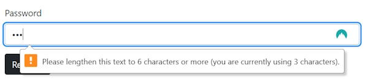
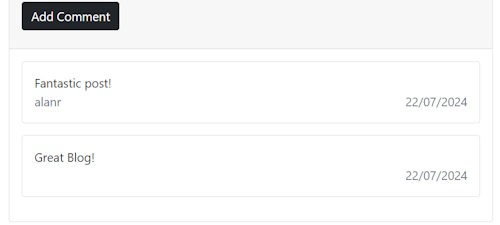
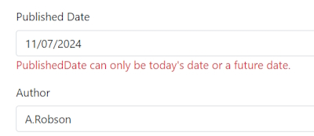
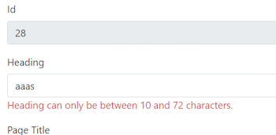

# Server side and Client side Validations

## Client side validations

Happen in the Clients Browser and are fast because there is no trip back to the Server.

Can easily be manipulated in the Browser.

This is fine for User feedback but not good for security reasons.

## Server side validations

These happen in the Server (back end code).

Slower than Client side validations because they are sent to the server.

Safe and secure because the Client cannot change these validations.

Should be implemented regardless of any Client side validations.

## Server side validations for the Register page

As an example if we open the Register page and submit it without adding any user information we will end up with a nasty Form error and we see an exception.

This gives the user unwanted information. Let's add some validation and the first type of validation would be the ``Required`` annotation on our Model.

Go to the ``Register.cshtml.cs`` code class.

Note that we are using the ``RegisterViewModel``. Go to the Model.

Add the ``Required`` annotation to each field.

```bash
    public class Register
    {
        [Required]
        public string Username { get; set; }

        [Required]
        public string Email { get; set; }

        [Required]
        public string Password { get; set; }
    }
```

Now back in the ``Register.cshtml.cs`` class we need to check for validation in the ``OnPost()`` method. We use the ``ModelState`` to do this.

```bash
    public async Task<IActionResult> OnPost()
    {
        if (ModelState.IsValid)
        {
            var user = new IdentityUser
            {
                UserName = RegisterViewModel.Username,
                Email = RegisterViewModel.Email
            };

            var result = await userManager.CreateAsync(user, RegisterViewModel.Password);

            if (result.Succeeded)
            {
                var rolesResult = await userManager.AddToRoleAsync(user, "User");

                if (rolesResult.Succeeded)
                {
                    ViewData["Notification"] = new Notification
                    {
                        Type = Enums.NotificationType.Success,
                        Message = "User registered successfully!"
                    };

                    return Page();
                }
            }

            ViewData["Notification"] = new Notification
            {
                Type = Enums.NotificationType.Error,
                Message = "User NOT registered!"
            };

            return Page();
        }
        else
        {
            return Page();
        }
    }
```

We add the ``ModelState.IsValid`` statement that is a boolean value. If ``true`` then the model is valid.

Note that we wrap the ``if`` statement around all of our code that is required to submit our data. This creates an error so we need to create an ``else`` block that finally returns the page if there are problems.

This will stop us from submitting an invalid Form. It would be better if we could display some more appropriate messages to the user.

We can add messages to the ``Register.cshtml`` page.

Inside the Form post area we have our fields we can add span elements to show our messages.

```bash
<div class="mb-3">
    <label class="form-label">Username</label>
    <input type="text" class="form-control" asp-for="RegisterViewModel.Username" />
    <span class="text-danger" asp-validation-for="RegisterViewModel.Username"></span>
</div>

<div class="mb-3">
    <label class="form-label">Email</label>
    <input type="email" class="form-control" asp-for="RegisterViewModel.Email" />
    <span class="text-danger" asp-validation-for="RegisterViewModel.Email"></span>
</div>

<div class="mb-3">
    <label class="form-label">Password</label>
    <input type="password" class="form-control" asp-for="RegisterViewModel.Password" />
    <span class="text-danger" asp-validation-for="RegisterViewModel.Password"></span>
</div>
```

Now run the page and don't add any text to the fields. We should get this result.


We are getting some error validation but there is more that we can do. The Email field must be a valid email address. We can't just add a number of characters and expect them to be a valid Email address.

We have some Client side validation with the Input type being ``email``.

```bash
    <input type="email" class="form-control" asp-for="RegisterViewModel.Email" />
```


We can add Server side validation in the Model.

```bash
    [Required]
    [EmailAddress]
    public string Email { get; set; }
```

If we put the wrong data in the ``Email`` field we will get this error.

We also have a size limit on the number of characters in our ``Password`` field. In the ``Program.cs`` file we have already set some limits.

```bash
    builder.Services.Configure<IdentityOptions>(options =>
    {
        // Default password settings
        options.Password.RequireDigit = true;
        options.Password.RequireNonAlphanumeric = true;
        options.Password.RequireUppercase = false;
        options.Password.RequiredLength = 6;
    });
```

We can also add an annotation to force a minimum Password length in the Model.

```bash
    [Required]
    [MinLength(6)]
    public string? Password { get; set; }
```

With these annotations we have validated our fields on the Server side.

## Client side validations for he Register page

It is important to add the Server side validation **before** you add the Client side validation.

We have our three fields in the ``Register.cshtml`` page. We can add the ``required`` annotation to each field and with the ``Password`` we can add a minimum length attribute.

```bash
<div class="mb-3">
    <label class="form-label">Username</label>
    <input type="text" class="form-control" asp-for="RegisterViewModel.Username" required />
    <span class="text-danger" asp-validation-for="RegisterViewModel.Username"></span>
</div>

<div class="mb-3">
    <label class="form-label">Email</label>
    <input type="email" class="form-control" asp-for="RegisterViewModel.Email" required />
    <span class="text-danger" asp-validation-for="RegisterViewModel.Email"></span>
</div>

<div class="mb-3">
    <label class="form-label">Password</label>
    <input type="password" class="form-control" asp-for="RegisterViewModel.Password" required minlength="6" />
    <span class="text-danger" asp-validation-for="RegisterViewModel.Password"></span>
</div>
```

I now run the Form with valid ``Username`` and ``Email`` fields. Add 3 characters into the ``Password`` field.



Using these attributes says that we have finished our Client side validation.

## Validating the Login page

### Server side

Work on the Server side first to provide Server validation.

Add validation to the ViewModel.

```bash
    public class Login
    {
        [Required]
        public string Username { get; set; }

        [Required]
        [MinLength(6)]
        public string Password { get; set; }
    }
```

Now add a validation check to the ``OnPost()`` method.

```bash
    public async Task<IActionResult> OnPost(string ReturnUrl)
    {
        if (ModelState.IsValid)
        {
            var signInResult = await signInManager.PasswordSignInAsync(
            LoginViewModel.Username, LoginViewModel.Password, false, false);

            if (signInResult.Succeeded)
            {
                if (!string.IsNullOrWhiteSpace(ReturnUrl))
                {
                    return RedirectToPage(ReturnUrl);
                }

                return RedirectToPage("Index");
            }
            else
            {
                ViewData["Notification"] = new Notification
                {
                    Type = Enums.NotificationType.Error,
                    Message = "Unable to login"
                };

                return Page();
            }
        }

        return Page();
    }
```

### Client side

Add validation to the ``Login`` Razor page.

We add the ``required`` attributes to the ``Username`` and ``Password`` fields.

We also add the ``minlength`` attribute to the ``password`` field.

We then add span elements to the fields to add validation messages.

```bash
<div class="container mx-auto">
    <div class="row justify-content-center">
        <div class="col-12 col-lg-6">

            <h1 class="mt-5 mb-3 h3">Login</h1>

            <partial name="_Notification">

                <form method="post">

                    <div class="mb-3">
                        <label class="form-label">Username</label>
                        <input type="text" class="form-control" asp-for="LoginViewModel.Username" required />
                        <span class="text-danger" asp-validation-for="LoginViewModel.Username"></span>
                    </div>

                    <div class="mb-3">
                        <label class="form-label">Password</label>
                        <input type="password" class="form-control" asp-for="LoginViewModel.Password" required minlength="6" />
                        <span class="text-danger" asp-validation-for="LoginViewModel.Password"></span>
                    </div>

                    <div class="mb-3">
                        <button type="submit" class="btn bg-dark text-light">Login</button>
                    </div>

                </form>
        </div>
    </div>
</div>
```

Now test the validation. It fails.

There is one more thing that needs to be fixed here. Look at the ``OnPost()`` method above.

```bash
    public async Task<IActionResult> OnPost(string ReturnUrl)
    {
        ...
```

The parameter is expecting the ``ReturnUrl`` variable and it was a **null value**.


We can easily fix this by make ``ReturnUrl`` nullable. Add a **?** after the variable type.

```bash
    public async Task<IActionResult> OnPost(string? ReturnUrl)
    {
        ...
```

## Validating the Admin Add User page

### Server side

Add validation to the ViewModel.

```bash
    public class AddUser
    {
        [Required]
        public string Username { get; set; }

        [Required]
        public string Email { get; set; }

        [Required]
        [MinLength(6)]
        public string Password { get; set; }

        public bool AdminCheckbox { get; set; }
    }
```

Add ModelState to the Admin/Users ``Index`` page ``OnPost()`` method.

```bash
public async Task<IActionResult> OnPost()
{
    if (ModelState.IsValid)
    {
        var identityUser = new IdentityUser
        {
            UserName = AddUserRequest.Username,
            Email = AddUserRequest.Email
        };

        var roles = new List<string> { "User" };

        if (AddUserRequest.AdminCheckbox)
        {
            roles.Add("Admin");
        }

        var result = await userRepository.AddUser(identityUser, AddUserRequest.Password, roles);

        if (result)
        {
            return RedirectToPage("/Admin/Users/Index");
        }

        return Page();
    }

    return Page();
}
```

### Client side

We add validation to the 3 Identity fields in the ``Index`` Razor page.

```bash
<div class="modal-body">
    <div class="mb-3">
        <label class="form-label">Username</label>
        <input type="text" class="form-control" asp-for="AddUserRequest.Username" required />
        <span class="text-danger" asp-validation-for="AddUserRequest.Username"></span>
    </div>
    <div class="mb-3">
        <label class="form-label">Email</label>
        <input type="email" class="form-control" asp-for="AddUserRequest.Email" required />
        <span class="text-danger" asp-validation-for="AddUserRequest.Email"></span>
    </div>
    <div class="mb-3">
        <label class="form-label">Password</label>
        <input type="password" class="form-control" asp-for="AddUserRequest.Password" required minlength="6" />
        <span class="text-danger" asp-validation-for="AddUserRequest.Password"></span>
    </div>
    <div class="mb-3">
        <div class="form-check">
            <input class="form-check-input" type="checkbox"
                   value="User" checked disabled asp-for="AddUserRequest.AdminCheckbox">
            <label class="form-check-label" for="flexCheckDefault">
                User Role
            </label>
        </div>
    ...
```

### Exception error

Add a new User and we get an error message.


This is cause because we have returned to the Razor page for display without getting the list of Users.

We need to run the ``OnGet()`` method to get a list of all Users. We need to refactor our ``OnGet()`` method.

```bash
    public async Task<IActionResult> OnGet()
    {
        await GetUsers();

        return Page();
    }
```

We move the User code to a new method named ``GetUsers()``.

```bash
    private async Task GetUsers()
    {
        var users = await userRepository.GetAll();

        Users = new List<User>();

        foreach (var user in users)
        {
            Users.Add(new Models.ViewModels.User()
            {
                Id = Guid.Parse(user.Id),
                Username = user.UserName,
                Email = user.Email
            });
        };
    }
```

Now in the ``OnPost()`` method we can also use the new method, ``GetUsers()``.

```bash
            ...
            return Page();
        }

        await GetUsers();

        return Page();
    }
```

This will fix our exception and allow us to add a new User.

## Fix error on BlogPost where a User has been deleted

I have noticed that when I went to view a Blog Post it failed. On investigation I found that I had deleted a ``User`` that had posted comments to this particular Blog Post. Because there was no ``Username`` on a comment it cause an exception.

Looking in the database I realised that the ``UserId`` in the ``BlogPostComment`` table still had comments by that ``UserId``. I have written some code to get around the ``User`` not existing in the database anymore.

### Details.cshtml.cs

```bash
    private async Task GetComments()
    {
        var blogPostComments = await commentRepository.GetComments(BlogPost.Id);

        var blogCommentsViewModel = new List<BlogComment>();

        foreach (var comment in blogPostComments)
        {
            var user = await userManager.FindByIdAsync(comment.UserId.ToString());
            var userName = user?.UserName ?? string.Empty;

            blogCommentsViewModel.Add(new BlogComment
            {
                DateAdded = comment.DateAdded,
                Description = comment.Description,
                Username = userName
            });
        }

        Comments = blogCommentsViewModel;
    }
```

We now check to see if the ``user`` exists. If they don't I make the ``Username = string.Empty``.



Note that the second comment doesn't have a ``Username``.

## Adding validations to our Add Blog Post page

Look in the ``Add`` Code Behind class and you will notice we are using the ``AddBlogPost`` ViewModel. Go to that model.

We will change each property to have the ``Required`` attribute except the ``Visible`` boolean property.

When the Form is submitted we use the ``OnPost()`` method. Add a ModelState ``if`` block around the code.

```bash
public async Task<IActionResult> OnPost()
{
    if (ModelState.IsValid)
    {
        var blogPost = new BlogPost()
        {
            Heading = AddBlogPostRequest.Heading,
            PageTitle = AddBlogPostRequest.PageTitle,
            Content = AddBlogPostRequest.Content,
            ShortDescription = AddBlogPostRequest.ShortDescription,
            FeaturedImageUrl = AddBlogPostRequest.FeaturedImageUrl,
            UrlHandle = AddBlogPostRequest.UrlHandle,
            PublishedDate = AddBlogPostRequest.PublishedDate,
            Author = AddBlogPostRequest.Author,
            Visible = AddBlogPostRequest.Visible,
            Tags = new List<Tag>(Tags.Split(',').Select(x => new Tag() { Name = x.Trim() }))
        };

        var result = await blogPostRepository.AddAsync(blogPost);

        var notification = new Notification
        {
            Type = Enums.NotificationType.Success,
            Message = $"A new Post with the Title: \"{result.PageTitle}\" has been created!"
        };

        TempData["Notification"] = JsonSerializer.Serialize(notification);

        return RedirectToPage("/Admin/Blogs/List");
    }

    return Page();
}
```

We also have a List of ``Tags`` that need to have the ``Required`` attribute.

```bash
    [BindProperty]
    [Required]
    public string Tags { get; set; }
```

Now open the ``Add.cshtml`` Razor page. We will add a ``span`` element containing the validation helpers on our ``Required`` fields.

Example.

```bash
    <span class="text-danger" asp-validation-for="AddBlogPostRequest.Heading"></span>
```

Now log in as superAdmin and try and submit a new Blog Post with no information. You will get an *add information* message in your fields.

### Adding your own business validations

For example, the ``PublishedDate`` must be the current date or a future date, not a previous date.

We will create a private method to add our business validations.

```bash
    private void ValidateBlogPost()
    {
        if (AddBlogPostRequest.PublishedDate.Date < DateTime.Now.Date)
        {
            ModelState.AddModelError("AddBlogPostRequest.PublishedDate",
                $"PublishedDate can only be today's date or a future date.");
        }
    }
```

Add it before the ModelState ``if`` block in our OnPost() method.

```bash
    public async Task<IActionResult> OnPost()
    {
        ValidateBlogPost();

        if (ModelState.IsValid)
        {
            var blogPost = new BlogPost()
            ...
```

Now try and add a Blog Post with a previous date value.



The business validation is working as expected.

### Important note

The ``FeaturedImage`` property is used to hold the Url of the main image. It shouldn't be part of the validation because it isn't part of the model.

It was failing validation because the property was implicitly required.

```bash
    [BindProperty]
    public IFormFile FeaturedImage { get; set; }
```

Making this nullable stops the validation and allows the ModelState to pass.

```bash
    [BindProperty]
    public IFormFile? FeaturedImage { get; set; }
```

### Add Client side validation

Add a ``required`` attribute on each of the required fields. E.g.

```bash
<input type="text" class="form-control" id="heading" asp-for="AddBlogPostRequest.Heading" required>
```

Don't add this to the ``FeaturedImage`` field.

## Edit Blog Post page

If you look at the ``Edit.cshtml.cs`` class you will see that we are using the ``BlogPost`` Domain model class. We need to change this to a ViewModel named ``EditBlogPost.cs``.

```bash
    public class EditBlogPost
    {
        public Guid Id { get; set; }

        public string Heading { get; set; }
        
        public string PageTitle { get; set; }
        
        public string Content { get; set; }
        
        public string ShortDescription { get; set; }
        
        public string FeaturedImageUrl { get; set; }
        
        public string UrlHandle { get; set; }
        
        public DateTime PublishedDate { get; set; }
        
        public string Author { get; set; }

        public bool Visible { get; set; }
    }
```

Now we have to change the ``Edit.cshtml.cs class``. First change the ``BlogPost`` Domain model property to the ViewModel, ``EditBlogPost``.

```bash
    [BindProperty]
    public EditBlogPost BlogPost { get; set; }
```

Now change the ``OnGet()`` method. Change the ``blogPost`` variable to ``blogPostDomainModel``.

```bash
    var blogPostDomainModel = await blogPostRepository.GetAsync(id);
```

Now we have to map the DomainModel to the ViewModel.

```bash
public async Task OnGet(int id)
{
    var blogPostDomainModel = await blogPostRepository.GetAsync(id);

    if (blogPostDomainModel != null && blogPostDomainModel.Tags != null) 
    {
        BlogPost = new EditBlogPost
        {
            Id = blogPostDomainModel.Id,
            Heading = blogPostDomainModel.Heading,
            PageTitle = blogPostDomainModel.PageTitle,
            Content = blogPostDomainModel.Content,
            ShortDescription = blogPostDomainModel.ShortDescription,
            FeaturedImageUrl = blogPostDomainModel.FeaturedImageUrl,
            UrlHandle = blogPostDomainModel.UrlHandle,
            PublishedDate = blogPostDomainModel.PublishedDate,
            Author = blogPostDomainModel.Author,
            Visible = blogPostDomainModel.Visible
        };

        Tags = string.Join(',', blogPostDomainModel.Tags.Select(x => x.Name));
    }
}
```

Because we have left the ViewModel name as ``BlogPost`` means that we don't have to do any changes in the ``Edit.cshtml`` Razor page.

Now run the application to see if you can open the ``Edit.cshtml`` Razor page. When you update a record it should work. We are now using a View Model instead of a Domain Model which the the better practice.

We are now at the stage of adding validation. Because we are using View Models we have to add the attributes. When we are using Domain Models the attributes aren't required.

```bash
    public class EditBlogPost
    {
        [Required]
        public Guid Id { get; set; }

        [Required]
        public string Heading { get; set; }
        
        [Required]
        public string PageTitle { get; set; }
        
        [Required]
        public string Content { get; set; }
        
        [Required]
        public string ShortDescription { get; set; }
        
        [Required]
        public string FeaturedImageUrl { get; set; }
        
        [Required]
        public string UrlHandle { get; set; }
        
        [Required]
        public DateTime PublishedDate { get; set; }
        
        [Required]
        public string Author { get; set; }

        public bool Visible { get; set; }
    }
```

Now add the ``ModelState`` block to your ``OnPostEdit()`` method.

On the Edit.cshtml page add the validation span elements to each field. E.g.

```bash
    <span class="text-danger" asp-validation-for="BlogPost.Id"></span>
```

Also add the required attribute to the input types.

```bash
    <input type="text" class="form-control" id="id" asp-for="BlogPost.Id" readonly required>
```

In the Code Behind class also add a ``Required`` attribute to the ``Tags`` property.

You should be ready to test that the validations are working correctly.

We can also add our own custom validations to properties. For example, we will make the ``Heading`` field have a maximum of 72 characters.

Add a new private method to the Code Behind class (``Edit.cshtml.cs``).

```bash
    private void ValidateEditBlogPost()
    {
        if (!string.IsNullOrWhiteSpace(BlogPost.Heading))
        {
            if (BlogPost.Heading.Length < 10 || BlogPost.Heading.Length > 72)
            {
                ModelState.AddModelError("BlogPost.Heading",
                    "Heading can only be between 10 and 72 characters.");
            }
        }
    }
```

At the start of the OnPostEdit() method add this statement.

```bash
    ValidateEditBlogPost();
```

Now test that your custom validation is working. 

Minimum test.



This shows that the custom validation is working.

## Validate BlogPostComments and the BlogPost page

Add validation to ``BlogPostComments``.

In ``Details.cshtml.cs``.

Add validation to the ``CommentDescription`` property.

```bash
    [BindProperty]
    [Required]
    [MinLength(1)]
    [MaxLength(200)]
    public string CommentDescription { get; set; }
```

Abstract out the ``OnGet()`` method so that it can also be added to the ``OnPost()`` method.

```bash
    public async Task<IActionResult> OnGet(string urlHandle)
    {
        await GetBlog(urlHandle);

        return Page();
    }
```

Create the new private ``GetBlog()`` method.

```bash
private async Task GetBlog(string urlHandle)
{
    BlogPost = await blogPostRepository.GetAsync(urlHandle);

    if (BlogPost != null)
    {
        BlogPostId = BlogPost.Id;
        if (signInManager.IsSignedIn(User))
        {
            var likes = await likeRepository.GetLikesForBlog(BlogPost.Id);

            var userId = userManager.GetUserId(User);

            Liked = likes.Any(x => x.UserId == Guid.Parse(userId));

            await GetComments();
        }

        TotalLikes = await likeRepository.GetTotalLikesForBlog(BlogPost.Id);
    }
}
```

Now add a validation check to the ``OnPost()`` method. 

```bash
public async Task<IActionResult> OnPost(string urlHandle)
{
    if (ModelState.IsValid)
    {
        if (signInManager.IsSignedIn(User) && !string.IsNullOrWhiteSpace(CommentDescription))
        {
            var userId = userManager.GetUserId(User);

            var comment = new BlogPostComment()
            {
                BlogPostId = BlogPostId,
                Description = CommentDescription,
                DateAdded = DateTime.Now,
                UserId = Guid.Parse(userId)
            };

            await commentRepository.AddComment(comment);
        }

        return RedirectToPage("/BlogPage/Details", new { urlHandle = urlHandle });
    }

    await GetBlog(urlHandle);

    return Page();
}
```

On the client side, ``Edit.cshtml`` add validation to the ``CommentDescription``.

```bash
<div class="mb-3">
    <label class="form-label">Comment Description</label>
    <input type="text" class="form-control" asp-for="CommentDescription" />
    <span class="text-danger" asp-validation-for="CommentDescription"></span>
</div>
```

Test to make sure the comments are being added.

There is one more minor fix that we need to do. If the user enters an invalid Blog Post handle it will cause an error.

We can fix this by shifting the ViewData ``Title`` inside the ``Model.BlogPost`` check..

 ```bash
    @if (Model.BlogPost != null)
    {
        <div class="container my-5">
            <div class="row justify-content-center">
                <div class="col-12 col-lg-6">

                    @{
                        ViewData["Title"] = Model.BlogPost.PageTitle;
                    }
                    ...
 ```
