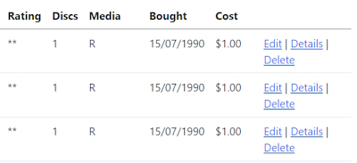

# Entity Framework with Database First

This is how we create the context and entity classes for an existing database in Entity Framework Core. Creating entity & context classes for an existing database is called Database-First approach.

## Install NuGet packages

> Install-Package Microsoft.EntityFrameworkCore.SqlServer       
>       
> Install-Package Microsoft.EntityFrameworkCore.Tools

## Connecting to RecordDb Database

Run this command in the Package Manager Console (I am using a Docker container of the database).

```bash
Scaffold-DbContext "Server=recorddb,11433;Database=RecordDB;User Id=sa;Password=your-password;TrustServerCertificate=True;" Microsoft.EntityFrameworkCore.SqlServer -OutputDir Models
```

It will build up the Models for your Database and the ``RecordDbContext``.

**Note:** I found a nice way to change a DateTime value into a Date value. My Record entity has a DateTime field named ``Bought``. I am only interested in the date values so I can do this in the ``Record`` Entity.

```bash
    [DisplayFormat(DataFormatString = "{0:dd/MM/yyyy}", ApplyFormatInEditMode = true)]
    public DateTime? Bought { get; set; }
```

Output format:


