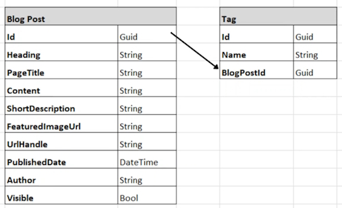

# Create an ASP.Net Core Razor pages Project

Use the ``ASP.Net Core Razor pages`` template.

## Create a Domain model

### Blog Post and Tag



#### BlogPost.cs

```bash
    public class BlogPost
    {
        public Guid Id { get; set; }
        public string Heading { get; set; }
        public string PageTitle { get; set; }
        public string Content { get; set; }
        public string ShortDescription { get; set; }
        public string FeaturedImageUrl { get; set; }
        public string UrlHandle { get; set; }
        public DateTime PublishedDate { get; set; }
        public string Author { get; set; }
        public bool Visible { get; set; }
    }
```

#### Tag.cs

```bash
    public Guid Id { get; set; }
    public string Name { get; set; }

    public Guid BlogPostId { get; set; }
```

### Add Entity Framework Core Packages

> Install-Package Microsoft.EntityFrameworkCore.SqlServer
> Install-Package Microsoft.EntityFrameworkCore.Tools

### Creating the DbContext Class

#### BlogDbContext.cs

```bash
    using Microsoft.EntityFrameworkCore;

    namespace Blog.Data
    {
        public class BlogDbContext: DbContext
        {

        }
    }
```

To inherit from EntityFramework's ``DbContext`` we add the following to the class definition.

```bash
    public class BlogDbContext: DbContext
    {

    }
```

Now create a constructor and add the ``DbSet<>`` collections.

```bash
    public class BlogDbContext : DbContext
    {
        public BlogDbContext(DbContextOptions options) : base(options)
        {
        }

        public DbSet<BlogPost> BlogPosts { get; set; }
        public DbSet<Tag> Tags { get; set; }
    }
```

### Adding a Connection string to the Database

In ``appstettings.json`` add.

```bash
    "ConnectionStrings": {
      "BlogDb": "Server=TIGER;Database=Blog;Trusted_Connection=True;TrustServerCertificate=True;"
    }
```

**Note:** I have to add ``TrustServerCertificate=True;`` to my connection string setting otherwise the connection doesn't work.

### Injecting DbContext into our application

In the ``builder.Services`` section of ``Program.cs``.

```bash
    builder.Services.AddDbContext<BlogDbContext>(options => 
        options.UseSqlServer(builder.Configuration.GetConnectionString("BlogDb")));
```

### Run the EF Migrations

Run this.

> Add-Migration "Initial migration"

To create the Database.

> Update-Database
