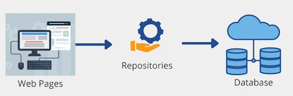
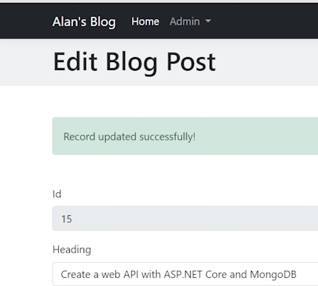
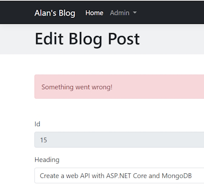

# The Repository Pattern 



We are going to implement the Repository pattern into our application.

The Repository pattern sits between our application and the database using a collection like interface to access the domain objects.

A Repository pattern isolates all of the code from the rest of the application. The advantage of this is that if you need to make changes to you application you only have to change the Repository. The web pages that implement these changes will remain the same.

## Creating a Repository

First you have to create an interface for the Repository. After that you have to inject the Repository inside your ``Program.cs`` services collection and then you can use your repository wherever it is needed.

Create a ``Repository`` folder in your project. Inside this we will create an Interface for our ``BlogPost`` domain named  ``IBlogPostRepository``.

### IBlogPostRepository

```bash
    public interface IBlogPostRepository
    {
        Task<IEnumerable<BlogPost>> GetAllAsync();
        Task<BlogPost> GetAsync(int id);
        Task<BlogPost> AddAsync(BlogPost blogPost);
        Task<BlogPost> UpdateAsync(BlogPost blogPost);
        Task<bool> DeleteAsync(int id);
    }
```

These are the methods that we will need in our Repository. Note that we name all methods with an ``Async`` suffix.

Now Create a ``BlogPostRepository`` class and let it inherit from ``IBlogPostRepository``. We are now able to implement all of our methods.

Note that you get an error on ``IBlogPostRepository`` and this means that you haven't implemented all of the Interface methods in your class.

To do this we can right-click on ``IBlogPostRepository`` and there is an option to ``Implement Interface``. Accept this and it will scaffold your class.

```bash
    public class BlogPostRepository : IBlogPostRepository
    {
        public Task<BlogPost> AddAsync(BlogPost blogPost)
        {
            throw new NotImplementedException();
        }

        public Task<bool> DeleteAsync(int id)
        {
            throw new NotImplementedException();
        }

        public Task<IEnumerable<BlogPost>> GetAllAsync()
        {
            throw new NotImplementedException();
        }

        public Task<BlogPost> GetAsync(int id)
        {
            throw new NotImplementedException();
        }

        public Task<BlogPost> UpdateAsync(BlogPost blogPost)
        {
            throw new NotImplementedException();
        }
    }
```

**Note:** all ``async`` annotations are missing before the ``Task`` implementations. Add these.

Next add a constructor and inject the ``BlogDbContext`` context so that we can use it in all of our methods.

The first method we will work with is the ``AddAsync()`` method. To complete this we will have to go to the ``Add()`` Razor page's Code Behind class and copy the two ``async`` method calls from the ``OnPost()`` method.

```bash
    public async Task<BlogPost> AddAsync(BlogPost blogPost)
    {
        await blogDbContext.BlogPosts.AddAsync(blogPost);
        await blogDbContext.SaveChangesAsync();

        return blogPost;
    }
```

### GetAllAsync() method

```bash
    public async Task<IEnumerable<BlogPost>> GetAllAsync()
    {
        return await blogDbContext.BlogPosts.ToListAsync();
    }
```

**Note:** we get an error in ``ToListAsync()`` and to fix this you need to bring in the using statement for ``Microsoft.EntityFrameworkCore``.

### UpdateAsync() method

```bash
    public async Task<BlogPost> UpdateAsync(BlogPost blogPost)
    {
        var existingPost = await blogDbContext.BlogPosts.FindAsync(blogPost.Id);

        if (existingPost != null)
        {
            existingPost.Heading = blogPost.Heading;
            existingPost.PageTitle = blogPost.PageTitle;
            existingPost.Content = blogPost.Content;
            existingPost.ShortDescription = blogPost.ShortDescription;
            existingPost.FeaturedImageUrl = blogPost.FeaturedImageUrl;
            existingPost.UrlHandle = blogPost.UrlHandle;
            existingPost.PublishedDate = blogPost.PublishedDate;
            existingPost.Author = blogPost.Author;
            existingPost.Visible = blogPost.Visible;

            await blogDbContext.SaveChangesAsync();
        }

        return existingPost;
    }
```

In this case we are finding the entity from the ``FindAsync()`` method. If the entity has been found we save it to an ``existingPost`` object. We then replace the ``existingPost`` object with the updated content from ``blogPost``. We then ``SaveChangesAsync()``.

### DeleteAsync() method

```bash
    public async Task<bool> DeleteAsync(int id)
    {
        var existingPost = await blogDbContext.BlogPosts.FindAsync(id);
    
        if (existingPost != null)
        {
            blogDbContext.BlogPosts.Remove(existingPost);
            await blogDbContext.SaveChangesAsync();
    
            return true;
        }

        return false;
    }
```

Once again we try to find the entity based on the ``id`` value. If found we remove it and return a ``true`` value.

## Injecting Repositories in our Services

We now need to inject the Repository into the services of our application. Inside the Services section of ``Program.cs`` we add this service.

```bash
    builder.Services.AddScoped<IBlogPostRepository, BlogPostRepository>();
```

We are now ready to use Dependency Injection to inject the Repository service into our Web pages code.

In each of the Code Behind files we have to change our constructor to e.g.

```bash
    public IBlogPostRepository blogPostRepository { get; }

    public AddModel(IBlogPostRepository blogPostRepository)
    {
        this.blogPostRepository = blogPostRepository;
    }
```

**Note:** we have removed the ``BlogDbContext`` because we don't need it anymore.

### Add.cshtml.cs

```bash
    public async Task<IActionResult> OnPost()
    {
        var blogPost = new BlogPost()
        {
            Heading = AddBlogPostRequest.Heading,
            PageTitle = AddBlogPostRequest.PageTitle,
            Content = AddBlogPostRequest.Content,
            ShortDescription = AddBlogPostRequest.ShortDescription,
            FeaturedImageUrl = AddBlogPostRequest.FeaturedImageUrl,
            UrlHandle = AddBlogPostRequest.UrlHandle,
            PublishedDate = AddBlogPostRequest.PublishedDate,
            Author = AddBlogPostRequest.Author,
            Visible = AddBlogPostRequest.Visible
        };

        await blogPostRepository.AddAsync(blogPost);
        
        return RedirectToPage("/Admin/Blogs/List");
    }
```

We have changed the database call to a Repository call. We are now using best practice by calling the Repository instead of the database.

**Important note:** if we decide that we want to change our database to another format such as MongoDB. MySQl, etc, all we have to do is make changes to the Repository. The Web pages will not have to be changed at all.

### Edit.cshtml.cs

```bash
    public async Task OnGet(BlogPost id)
    {
        BlogPost = await blogPostRepository.GetAsync(id);
    }

    public async Task<IActionResult> OnPostEdit()
    {
        await blogPostRepository.UpdateAsync(BlogPost);

        return RedirectToPage("/Admin/Blogs/List");
    }

    public async Task<IActionResult> OnPostDelete(int id)
    {
        var deleted = await blogPostRepository.DeleteAsync(BlogPost.Id);

        if (deleted)
        {
            return RedirectToPage("/Admin/Blogs/List");
        }

        return Page();
    }
```

Once we add all of the Repository methods our page code looks much cleaner.

### List.cshtml.cs

```bash
    public async Task OnGet()
    {
        BlogPosts = (await blogPostRepository.GetAllAsync())?.ToList();
    }
```

**Note:** we have to enclose the ``await`` statement in brackets to get all the BlogPosts and then we can change the BlogPosts into a ``List<BlogPost>`` list.

### Details.cshtml.cs

```bash
    public async Task OnGet(int id)
    {
        BlogPost = await blogPostRepository.GetAsync(id);
    }
```

This will bring back one ``BlogPost`` that we can use to show its details.

Once we have finished adding the Repository to all of the pages we need to do some testing to make sure our application is working correctly.

## Showing notifications using ViewData

We want to create notification messages every time a database task has been completed. For example, when a user edits a BlogPost we want to show a Success message.

We will use ``ViewData`` which is a container that passes data from the PageModel to the Content page. ``ViewData`` is a dictionary of objects with a string based key.

In page.

```bash
    ViewData["MyString"] = "Hello World!";
```

In View

```bash
    <h2>@ViewData["MyString"]</h2>
```

In PageModel.

```bash
    public async Task<IActionResult> OnPostEdit()
    {
        await blogPostRepository.UpdateAsync(BlogPost);

        ViewData["Message"] = "Post was updated!";
        
        return Page();
    }
```

In View.

```bash
<div class="container">
    <h3 class="alert-success">@ViewData["Message"]</h3>
    <form method="post">
        <div class="mb-3">
            <label for="heading" class="form-label">Id</label>
            <input type="text" class="form-control" id="id" asp-for="BlogPost.Id" readonly>
        </div>
```


## Showing notifications using TempData

``TempData`` is a way of passing data from one page to another. For example, You want to pass the success message from the ``Edit`` page to the ``List`` page.

``TempData`` is a storage container for data that needs to be available to a separate HTTP request. We can make use of ``TempData`` to show feedback to a user after a form submission that results in a user being redirected to another page (``Post-Redirect-Get``).

In page.

```bash
    TempData["MyString"] = "Hello World!";
```

In View.

```bash
    <h2>@TempData["MyString"]</h2>
```

We will ``Add`` a new Blog Post and grab the ``PageTitle``. Then we will use ``TempData`` to pass a message to the ``List`` page.

In the ``OnPost()`` method in ``Add.cshtml.cs`` we will use ``TempData`` to create a message.

```bash
    var result = await blogPostRepository.AddAsync(blogPost);

    TempData["Message"] = $"A new Post with Title: \"{result.PageTitle}\" has been created!";

    return RedirectToPage("/Admin/Blogs/List");
```

Now in the ``List.cshtml`` view page.

```bash
@{
    string message = (string)ViewData["Message"];
}

@if (!string.IsNullOrWhiteSpace(message))
{
    <div class="container mb-5">
        <div class="alert alert-success alert-dismissible fade show mb-5 rounded-2" role="alert">
            @Html.Raw(message)
            <button type="button" class="btn-close" data-bs-dismiss="alert" aria-label="Close"></button>
        </div>
    </div>
}
```

Add a new message to see the success message.


## Generic notifications

On our ``Edit`` CodeBehind page we have a success message but what happens if we have an error?

We have ``ViewData`` storing our data but a better method would be to create a View Model. In the View Model you can have properties with different messages.

In ``Models->ViewModels`` make a new View Model class.

### Notification.cs

```bash
    public class Notification
    {
        public string Message { get; set; }

        public NotificationType Type { get; set; }
    }
```

This will be a generic class that will be used to store notifications for all of our database interactions.

We need to create an ``Enum`` to hold the type of notification we just carried out. ``Success``, ``Info`` or ``Error``.

Create an ``Enums`` folder. Add a class into this folder named ``NotificationType``. Change the word ``class`` to ``enum``.

```bash
    public enum NotificationType
    {
        Success,
        Info,
        Error
    }
```

In the ``Edit.cshtml.cs`` Page Model we can now use this ``Notification`` class to show a generic message.

We will change the ``OnPost()`` method.

```bash
    public async Task<IActionResult> OnPostEdit()
    {
        await blogPostRepository.UpdateAsync(BlogPost);

        var blogPostDomainModel = new BlogPost
        {
            Id = BlogPost.Id,
            Heading = BlogPost.Heading,
            PageTitle = BlogPost.PageTitle,
            Content = BlogPost.Content,
            ShortDescription = BlogPost.ShortDescription,
            FeaturedImageUrl = BlogPost.FeaturedImageUrl,
            UrlHandle = BlogPost.UrlHandle,
            PublishedDate = BlogPost.PublishedDate,
            Author = BlogPost.Author,
            Visible = BlogPost.Visible,
        };

        await blogPostRepository.UpdateAsync(blogPostDomainModel);

        ViewData["Notification"] = new Notification
        {
            Type = Enums.NotificationType.Success,
            Message = "Record updated successfully!"
        };

        return Page();
    }
```

In this code we create ``ViewData`` Notification that has a ``Type`` and ``Message`` field. These will create a notification on how our Post process succeeded.

Now we need to work on the View Page, ``Edit.cshtml``. First we need to create a generic partial class that can be used on every View Page that needs a Notification message. We will create a ``_Notification.cshtml`` partial class in to the ``Shared`` folder.

### _Notification.cshtml

```bash
@using Blog.Models.ViewModels
@{
    var notification = (Notification)ViewData["Notification"];

    if (notification != null)
    {
        var notificationClass = string.Empty;
        switch (notification.Type)
        {
            case Enums.NotificationType.Success:
                notificationClass = "alert-success";
                break;
            case Enums.NotificationType.Info:
                notificationClass = "alert-secondary";
                break;
            case Enums.NotificationType.Error:
                notificationClass = "alert-danger";
                break;
            default:
                notificationClass = string.Empty;
                break;
        }

        <div class="container mb-5">
            <div class="alert @notificationClass alert-dismissible fade show mb-5 rounded-2" role="alert">
                @Html.Raw(notification.Message)
                <button type="button" class="btn-close" data-bs-dismiss="alert" aria-label="Close"></button>
            </div>
        </div>
    }
}
```

This Partial View Class create a Notification message on a page for us. The colour of the message is dependent on the status of the ``Notification.Type``. We use a ``Switch`` statement to create ``notificationClass`` variable that can change the colour of the message.

Now in the ``Edit.cshtml`` View Page we can add the Partial View.

```bash
    <partial name="_Notification"></partial>
```

This is all you need to do in your View Page. Once we run the Edit page again we will see this Success message.



This is the same as our previous message but this time it is a generic message.

## Notification for our Add page

First we will change the ``OnPost()`` method in our Page Model.

```bash
public async Task<IActionResult> OnPost()
{
    var blogPost = new BlogPost()
    {
        Heading = AddBlogPostRequest.Heading,
        PageTitle = AddBlogPostRequest.PageTitle,
        Content = AddBlogPostRequest.Content,
        ShortDescription = AddBlogPostRequest.ShortDescription,
        FeaturedImageUrl = AddBlogPostRequest.FeaturedImageUrl,
        UrlHandle = AddBlogPostRequest.UrlHandle,
        PublishedDate = AddBlogPostRequest.PublishedDate,
        Author = AddBlogPostRequest.Author,
        Visible = AddBlogPostRequest.Visible
    };

    var result = await blogPostRepository.AddAsync(blogPost);

    var notification = new Notification
    {
        Type = Enums.NotificationType.Success,
        Message = $"A new Post with the Title: \"{result.PageTitle}\" has been created!"
    };

    TempData["Notification"] = JsonSerializer.Serialize(notification);

    return RedirectToPage("/Admin/Blogs/List");
}
```

We create the Notification object with the message we require.

```bash
    var notification = new Notification
    {
        Type = Enums.NotificationType.Success,
        Message = $"A new Post with the Title: \"{result.PageTitle}\" has been created!"
    };
```

Next we still need to use the ``TempData`` because once we ``Post`` we need to ``Redirect`` to our ``Get`` method.

```bash    
    TempData["Notification"] = JsonSerializer.Serialize(notification);
```

**Note:** We have to serialise the Json otherwise we will get an error when using ``TempData``.

Now on the ``List`` Page Model ``Get()`` method.

```bash
public async Task OnGet()
{
    var notificationJson = (string)TempData["Notification"];

    if (notificationJson != null) 
    {
        ViewData["Notification"] = JsonSerializer.Deserialize<Notification>(notificationJson);
    }

    BlogPosts = (await blogPostRepository.GetAllAsync())?.ToList();
}
```

The processing for ``TempData`` is a little more complex.

First we get the Json ``TempData`` and use it a a ``string`` Json value.

```bash
    var notificationJson = (string)TempData["Notification"];
```

Next we test that the ``Notification`` object isn't a null value with.

```bash
    if (notificationJson != null) 
    {
        ViewData["Notification"] = JsonSerializer.Deserialize<Notification>(notificationJson);
    }
```

If we have a ``Notification`` object we need to ``Deserialize`` the Json into the object and this time seeing as we need the data on the View Page we can save it as a View Data container so that we can use it on the ``List`` View Page.

Once again on the List.cshtml page we just add the ``_Notification`` Partial View page.

```bash
    <partial name="_Notification"></partial>
```

Once we edit a record we will get a Success message.

## Adding an Error notification

On our ``Edit.cshtml.cs`` Page Model we will change the ``OnPostEdit()`` method to force an error.

```bash
    public async Task<IActionResult> OnPostEdit()
    {
        await blogPostRepository.UpdateAsync(BlogPost);

        try
        {
            throw new Exception();

            var blogPostDomainModel = new BlogPost
            {
                Id = BlogPost.Id,
                Heading = BlogPost.Heading,
                PageTitle = BlogPost.PageTitle,
                Content = BlogPost.Content,
                ShortDescription = BlogPost.ShortDescription,
                FeaturedImageUrl = BlogPost.FeaturedImageUrl,
                UrlHandle = BlogPost.UrlHandle,
                PublishedDate = BlogPost.PublishedDate,
                Author = BlogPost.Author,
                Visible = BlogPost.Visible,
            };

            await blogPostRepository.UpdateAsync(blogPostDomainModel);

            ViewData["Notification"] = new Notification
            {
                Type = Enums.NotificationType.Success,
                Message = "Record updated successfully!"
            };
        }
        catch (Exception ex)
        {
            ViewData["Notification"] = new Notification
            {
                Type = Enums.NotificationType.Error,
                Message = "Something went wrong!"
            };
        }

        return Page();
    }
```

We have added a ``try-catch`` block to catch the error. Note that when an Edit fails it will be sent to the ``catch`` part of the block.

In here we create another ViewData Notification but this time the Notification.Type will be a ``Enums.NotificationType.Error``.

To force an error we will throw an exception at the top of a ``try-catch`` block.

This will produce the following error message.



## Delete process

On the ``Edit.cshtml`` View Page we have a ``Delete`` button. We should now report back on the status of the Delete process.

The ``OnPostDelete()`` method needs to be changed.

```bash
    public async Task<IActionResult> OnPostDelete(int id)
    {
        var deleted = await blogPostRepository.DeleteAsync(BlogPost.Id);

        if (deleted)
        {
            var notification = new Notification
            {
                Type = Enums.NotificationType.Success,
                Message = $"The Post was deleted!"
            };

            TempData["Notification"] = JsonSerializer.Serialize(notification);

            return RedirectToPage("/Admin/Blogs/List");
        }
         
        return Page();
    }
```

Once again we have to use ``TempData`` because we are using the ``Post->Redirect->Get`` process.

We are Redirecting to the ``List`` View Page. We don't have to change anything on the List ``OnGet()`` method because we have already built the ``Notification`` process into this method. This is also the same for the the View Page.

We should see this message once we delete a record.


**Note:** in this ``OnPostDelete()`` method we need to do some extra work. We should try to get the record we are deleting to see if it actually exists. If it does we can then delete the record. We also need to add the failure message in case there is a problem.

### Summary

Now we have a Generic Notification object that can report back to any page on the status of a process.
