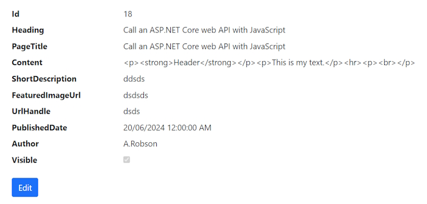
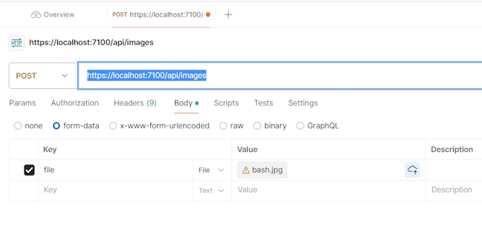
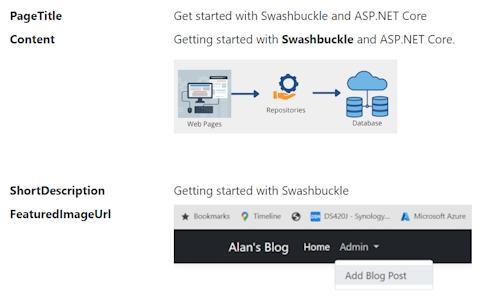

# 05-Adding an Editor and Image Upload

## Adding an Editor to our Add and Edit page
 
We are going to use ``Froala`` editor.

### Installing Froala editor

[Install Froala link.](https://froala.com/wysiwyg-editor/docs/overview/)

Click on ``Get Started`` link.

Select ``Choose Your Framework`` and select CDN. This will give you 2 links that you can add to ``_layout.cs``. Add these in the ``head`` section of your page.

```bash
<link href='https://cdn.jsdelivr.net/npm/froala-editor@latest/css/froala_editor.pkgd.min.css' rel='stylesheet' type='text/css' />

<script type='text/javascript' src='https://cdn.jsdelivr.net/npm/froala-editor@latest/js/froala_editor.pkgd.min.js'></script>
```

In the ``Add()`` page we are going add the text editor to the Content ``TextArea`` which has an id of ``"content"``.

At the bottom of the page we will add this script section.

```bash
    @section Scripts {
        <script>
            var editor = new FroalaEditor('#content');
        </script>
    }
```

When we open the ``Add()`` View Page we will see this.


Now we can add rich text and Froala text editor will turn it into Html code.

Some sample content.



We can add the same script section to our Edit View Page as it also has an Id of ``"content"``.

## Adding an Image Upload option to our application

We need to create an Image Upload API to our project.

Create a ``Controllers`` folder.

Add a new Controller into your folder using the MVC Empty template. Name it ``ImagesController.cs``.

Add the ``ApiController`` attribute to the Controller class. 

```bash
    [ApiController]
    public class ImagesController : Controller
    {
        public IActionResult Index()
        {
            return View();
        }
    }
```

This specifies that the Controller is an ``ApiController`` and doesn't have any views and all that it is doing is returning some data or performing an Action.

Now we need to add some routing. We will be adding a ``Get()`` method and  ``Post()`` method.

We will add routing to the Controller method.

```bash
    [ApiController]
    [Route("api/images")]
    public class ImagesController : Controller
    {
        public IActionResult Index()
        {
            return View();
        }
    }
```

The Controller can also be used in the Route with this line.

> [Route("api/[controller]")]

Which is the same as above.

The ``Get()`` method won't be used but we will create one for testing.

```bash
    [HttpGet]
    public IActionResult Index()
    {
        return Ok("This is the Images Get() method!");
    }
```

 **Note:** the ``HttpGet`` attribute lets you know that ``Index()`` is a **GET** method. We could also call the method ``Get()``.

In order to use any method in our API Controller we will have to change ``Program.cs`` to configure it to work with Razor pages.

Add the following line after ``AddRazorPages()``.

```bash
    // Add services to the container.
    builder.Services.AddRazorPages();

    builder.Services.AddControllers();
```

**Note:** there is also a ``builder.Services.AddControllersWithViews();`` but we aren't interested in creating views in this application.

This injects our Controller into the Services.

Next we need to configure the Controller inside the Http Request pipeline.

```bash
    app.MapRazorPages();
    app.MapControllers();
```

Now with these 2 changes we should be able to hit the ``Get()`` method inside our Controller.

Let's try it out.

> <https://localhost:7100/api/images>

Returns.

 Api method")

This shows that the **GET** request is working. We only use **Get** to check that our API is working.

## Create the Post method

Create this in ``ImagesController.cs``.

```bash
    [HttpPost]
    public async Task<IActionResult> UploadAsync(IFormFile file)
    {
        
    }
```

## Create the Image Repository

Create your Interface first.

### IImageRepository

```bash
    public interface IIimageRepository
    {
        Task<Image> UploadAsync(IFormFile file);
    }
```

Now create the implementation.

### ImageRepository.cs

```bash
    public class ImageRepository: IImageRepository
    {
        public async Task<string> UploadAsync(IFormFile file)
        {

        }
    }
```

## Create a Cloudinary account

We can create an account on [Cloudinary](https://cloundinary.com).

Create a new API key

Install Cloudinary in our application:

> Install-Package CloudinaryDotNet

### appsettings.json

Add this section after the connection strings.

```bash
    "Cloudinary": {
      "CloudName": "cloud name",
      "ApiKey": "key",
      "ApiSecret": "secret"
    }
```

Add a constructor into ``ImageRepository``.

```bash
    private readonly Account account;

    public ImageRepository(IConfiguration configuration)
    {
        account = new Account(configuration.GetSection("Cloudinary")["CloudName"],
            configuration.GetSection("Cloudinary")["ApiKey"],
            configuration.GetSection("Cloudinary")["ApiSecret"]);
    }
```

This contains our Cloudinary details.

Now we can finish off our ``UploadAsync()`` method in our ``ImagesRepository``.

```bash
    public async Task<string> UploadAsync(IFormFile file)
    {
        var client = new Cloudinary(account);
        var result = await client.UploadAsync(
            new CloudinaryDotNet.Actions.ImageUploadParams()
            {
                File = new FileDescription(file.FileName, file.OpenReadStream()),
                DisplayName = file.FileName
            });

        if (result != null && result.StatusCode == System.Net.HttpStatusCode.OK) 
        {
            return result.SecureUrl.ToString();
        }

        return null;
    }
```

## Inject our Image Repository and test Cloudinary

First we have to inject our ``ImageRepository`` into our application.

In ``Program.cs`` add the following line below the ``BlogRepository`` injection.

> ``builder.Services.AddScoped<IImageRepository, ImageRepository>();``

Now we can inject our ``ImageRepository`` into our ``ImagesController``. First create a constructor to inject our ``ImageRepository``.

```bash
    private readonly IImageRepository imageRepository;

    public ImagesController(IImageRepository imageRepository)
    {
        this.imageRepository = imageRepository;
    }
```

Now create our ``UploadAsync()`` **POST** method.

```bash
[HttpPost]
public async Task<IActionResult> UploadAsync(IFormFile file)
{

    // User repository to upload image
    var imageUrl = await imageRepository.UploadAsync(file);

    if (imageUrl == null)
    {
        return Problem("An Error occured!", null, (int)HttpStatusCode.InternalServerError);
    }

    return Json(new { link = imageUrl });
}
```

Use **Postman** to test the ``POST`` method

Url:

> [https://localhost:7100/api/images](https://localhost:7100/api/images)

We need to add a file to the FormData section in Postman.



Where the ``Key`` has to be type: **file** and you can select a file to upload in the ``Value`` tab.

When you run this it will return the following JSON.

```bash
{
    "link": "https://res.cloudinary.com/dil05udxh/image/upload/v1720070210/bhaniwzoafykfevfmewy.jpg"
}
```

If you browse to this URL you will see the image you uploaded.

This gives us confirmation that our image upload to Cloudinary is working.

If you go to Cloudinary you can see your digital assets and the image you uploaded.


## Calling Image Upload from a Razor page

In the ``Admin/Blogs/Add.cshtml`` page.

Add a new Div above the ``FeaturedImageUrl`` Div.

```bash
<div class="mb-3">
    <label for="featuredImageUpload" class="form-label">Featured Image Upload</label>
    <input type="file" id="featuredImageUpload" asp-for="FeaturedImage"/>
    
</div>
```

In the Code Behind we need to add a new property.

```bash
    [BindProperty]
    public IFormFile FeaturedImage { get; set; }
```

Make it bindable so that we can use it in our code.

Now in the script section of our Razor page add this JavaScript.

```bash
const featuredImageUploadElement = document.getElementById('featuredImageUpload');

async function uploadFeaturedImage(e) {
    console.log(e.target.files[0]);
}

featuredImageUploadElement.addEventListener('change', uploadFeaturedImage);
```

Run ``Add.cshtml`` and add an image.

In the Console window of your browser you should see this.


Once we have this image we have a way to call our Images Controller in the ``change`` method.

Create a JavaScript function to upload the image to Cloudinary.

```bash
const featuredImageUploadElement = document.getElementById('featuredImageUpload');
const featuredImageUrl = document.getElementById('featuredImageUrl');
const featuredImageDisplay = document.getElementById('featuredImageDisplay');

async function uploadFeaturedImage(e) {
    console.log(e.target.files[0]);

    let data = new FormData();
    data.append('file', e.target.files[0]);

    await fetch('/api/images', {
        method: 'POST',
        headers: {
            'Accept': '*/*',
        },
        body: data
    }).then(response => response.json())
        .then(result => {
            featuredImageUrl.value = result.link;
            featuredImageDisplay.style.display = 'block';
            featuredImageDisplay.src = result.link;
        });
}

featuredImageUploadElement.addEventListener('change', uploadFeaturedImage);
```

When you upload an image it will return the image Url in the FeaturedImageUrl field on the page.


## Add and Image Upload feature to Fraola editor

We also want to be able to add images to our Fraola text editor. Currently our editor is set up in the JavaScript like this.

```bash
    var editor = new FroalaEditor('#content');
```

We need to change this so that if we add an image into the Html content it will automatically be uploaded to Cloudinary.

We can add a JavaScript object to this statement to use the path ``/api/images`` that allows us to post the image to Cloudinary.

```bash
    var editor = new FroalaEditor('#content', {
        imageUploadURL: '/api/images'
    });
```

With this small change we can add an image and it will instantly upload to Cloudinary.

Now that we have finished the Add page we want to add changes to the ``Edit.cshtml`` Razor page.

Add a ``FeaturedImageUpload`` div above the ``FeaturedImageUrl`` Div.

```bash
<div class="mb-3">
    <label for="featuredImageUpload" class="form-label">Featured Image Upload</label>
    <input type="file" id="featuredImageUpload" asp-for="FeaturedImage" />

    @if (Model.BlogPost.FeaturedImageUrl != null)
    {
        
    }
    else
    {
        
    }
</div>
```

Change the ``script`` section to be the same as the ``Add.cshtml`` page.

On the Code Behind page add the ``FeaturedImage`` property.

```bash
    [BindProperty]
    public IFormFile FeaturedImage { get; set; }
```

Now test the page to see that it is working correctly.

### Details.cshtml

We have to make some minor changes to the Details pages so that we view Html code instead of text.

Change the ``content`` property.

```bash
    <dt class="col-sm-2">
        @Html.DisplayNameFor(model => model.BlogPost.Content)
    </dt>
    <dd class="col-sm-10">
        @Html.Raw(Model.BlogPost.Content)
    </dd>
```

Change the ``FeaturedImageUrl`` property.

```bash
    <dt class="col-sm-2">
        @Html.DisplayNameFor(model => model.BlogPost.FeaturedImageUrl)
    </dt>
    <dd class="col-sm-10">
        
    </dd>
```

Run this page and pick a blog post with images.


