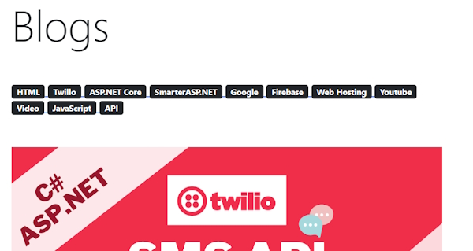
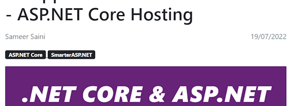

# Displaying Blogs and Tags

## Index page

The first thing we will do is build an ``Index.cshtml`` page that will show a Hero block and a list of Blogs.

### Index.cshtml

```bash
@page
@model IndexModel
@{
    ViewData["Title"] = "Home page";
}


<div class="container col-xxl-8 px-4 py-5">
    <div class="row align-items-center g-5 py-5">
        <div class="col-12 col-lg-6">
            <h1 class="display-5 fw-bold lh-1 mb-3">
                Alan's Blog<br/>- The Dev Blog
            </h1>
            <p class="lead">
                Alan's Blog is the home to coding blogs covering a vast range of topics like ASP.NET, C#, Javascript, SQL Server, MongoDB, etc. Want to read the latest dev articles? Join Alan's Blog to get weekly blogs in your email.
            </p>
        </div>
        <div class="col-12 col-lg-6">
            
        </div>
    </div>
</div>

<div class="container">
    <div class="row justify-content-center">
        <div class="col-6">

            <h2 class="mb-5 display-3">Blogs</h2>

            @if (Model.Blogs != null && Model.Blogs.Any())
            {
                foreach (var blog in Model.Blogs)
                {
                    <div class="mb-5 bg-light box-shadow">
                        
                        <div class="px-4 py-4">
                            <h2 class="mb-2">@blog.Heading.ToProperCase()</h2>
                            <p>
                                Author: @blog.Author
                                <br />
                                Date Published: @blog.PublishedDate.ToShortDateString()
                            </p>
                            <p class="mb-2">@blog.ShortDescription</p>
                            <a href="/blog/@blog.UrlHandle" class="btn btn-dark">Read More</a>
                        </div>
                    </div>
                }
            }
        </div>
    </div>
</div>
```

### Index.cshtml.cs

```bash
    private readonly ILogger<IndexModel> _logger;
    public IBlogPostRepository blogPostRepository { get; }

    public List<BlogPost> Blogs { get; set; }

    public IndexModel(ILogger<IndexModel> logger, IBlogPostRepository blogPostRepository)
    {
        _logger = logger;
        this.blogPostRepository = blogPostRepository;
    }

    public async Task<IActionResult> OnGet()
    {
        Blogs = (await blogPostRepository.GetAllAsync()).ToList();

        return Page();
    }
```

## Create a ToProperCase class

A number of headers contain uppercase words. The easy way would be to write them in the proper case in the first place.

Another way is to build a proper case string extension class.

First we have to add a line to ``_ViewImports.cshtml``.

```bash
    @using Blog.Models
```

We are going to add a class into the Models folder named ``StringExtensions.cs``.

```bash
    public static string ToProperCase(this string str)
    {
        if (string.IsNullOrWhiteSpace(str))
            return str;

        var words = str.Split(' ');
        for (int i = 0; i < words.Length; i++)
        {
            if (words[i].Length > 0)
            {
                words[i] = char.ToUpper(words[i][0]) + words[i].Substring(1).ToLower();
            }
        }

        var header = string.Join(" ", words);

        header = ProperCaseWords(header);

        return header;
    }

    private static string ProperCaseWords(string header)
    {
        var replacements = new Dictionary<string, string>(StringComparer.OrdinalIgnoreCase)
        {
            { "Javascript", "JavaScript" },
            { "Typescript", "TypeScript" },
            { "Mongodb", "MongoDB" },
            { "Asp.net", "ASP.NET" },
            { "Sms", "SMS" },
            { "Sql", "SQL" }
        };

        foreach (var replacement in replacements)
        {
            header = header.Replace(replacement.Key, replacement.Value, StringComparison.OrdinalIgnoreCase);
        }

        return header;
    }
```

``ToProperCase()`` will proper case the headers but words like JavaScript will become Javascript which is not the proper case. To get around this I have built another method named ``ProperCaseWords()`` to correctly case particular words.

This is what the final page looks like.


If you scroll down the page you will see the Blogs section.


## Displaying Blog details

We need to display the details of a Blog Post. To do this we will create a folder named ``BlogPage`` in the root of the ``Pages`` folder.

**Note:** I originally called the folder ``Blog`` but this conflicted with the name of the application. I need to be aware of this in other projects.

From here create a ``Details.cshtml`` Razor page.

We don't want to serve this page using the default routing. We need to take advantage of SEO to allow robots to find our content. We need to capture the Url handle of the Blog Post which is a search engine readable form of the blog. So we will override our existing route handling and create a different routing for this page.

We can do this by adding our route to the ``@page`` declaration.

```bash
    @page "/blog/details"
```

This is all we have to do to change the routing.

We need to make one more change to use the ``urlHandle`` from the BlogPost entity.

```bash
    @page "/blog/{urlHandle}"
```

Now the route will use the ``urlHandle`` field in the ``BlogPost`` table. Note that these are unique and are now human readable and search engine friendly.

For example we can search for this Url.

> <https://localhost:7100/blog/twilio-sms-api-tutorial-using-c-sharp-dot-net>

It doesn't return much content at present but will work. We need to be able to build the page content from a single BlogPost entity.

To retrieve the content for our Blog Post we need to add the ``urlHandle`` to our ``OnGet()`` method in the Code Behind class.

The next thing we need to do is change our ``Read more`` button on our ``Index.cshtml`` page so that it uses the ``urlHandle`` property.

```bash
    <a href="/blog/@blog.UrlHandle" class="btn btn-dark">Read more</a>
```

I will also an ``href`` to the leading post image so that I can click it to navigate to the Blog Post.

```bash
<a href="/blog/@blog.UrlHandle"></a>
```

Now we can work on getting our Blog Post. We have a ``GetAsync()`` method in our ``BlogPostRepository`` but it wants an ``id`` parameter so this wont work. We need to create a new method that requires a string parameter for ``urlHandle``.

In ``IBlogRepository`` add.

```bash
    Task<BlogPost> GetAsync(string urlHandle);
```

In ``BlogPostRepository``.

```bash
    public async Task<BlogPost> GetAsync(string urlHandle)
    {
        return await blogDbContext.BlogPosts.FirstOrDefaultAsync(x => x.UrlHandle == urlHandle);
    }
```

Now call the BlogPost from ``Details.cshtml.cs``.

```bash
    private readonly IBlogPostRepository blogPostRepository;

    public BlogPost BlogPost { get; set; }

    public DetailsModel(IBlogPostRepository blogPostRepository)
    {
        this.blogPostRepository = blogPostRepository;
    }

    public async Task<IActionResult> OnGet(string urlHandle)
    {
        BlogPost = await blogPostRepository.GetAsync(urlHandle);

        return Page();
    }
```

### Details.cshtml

```bash
@if (Model.BlogPost != null)
{
    <div class="container my-5">
        <div class="row justify-content-center">
            <div class="col-12 col-lg-6">

                @{
                    ViewData["Title"] = Model.BlogPost.PageTitle.ToProperCase();
                }

                <h1 class="mb-3">@Model.BlogPost.Heading.ToProperCase()</h1>

                <div class="d-flex justify-content-between mb-3">
                    <span class="text-secondary">@Model.BlogPost.Author</span>
                    <span class="text-secondary">@Model.BlogPost.PublishedDate.ToShortDateString()</span>
                </div>

                

                <div class="mb-3 blog-details">
                    @Html.Raw(Model.BlogPost.Content)
                </div>

            </div>
        </div>
    </div>
}
else
{
    <div class="container mt-3">
        <h2>Blog post not found!</h2>
    </div>
}
```

Note that the content is constrained with the CSS class, ``class="col-12 col-lg-6"``. This doesn't constrain the inline images which will be larger than the page width. We can constrain these with some CSS in the ``site.css`` file.

First we have to add a new class ``blog-details`` to our ``Content`` Div.

```bash
    <div class="mb-3 blog-details">
        @Html.Raw(Model.BlogPost.Content)
    </div>
```

Then add this class to ``site.css``.

```bash
    .blog-details img {
        max-width: 100%;
    }
```

This will constrain the image within the ``Content`` column.

## Adding and using Tags

We want to add Tags to our Blog Posts and use the Tags to navigate to other related Blog Posts. Will create a navigation property in Entity Framework Core so that we are able to create tags in our Blog Posts.

We need to create the navigation property and the relation between the Blog Post and the Tags. The navigation property in the database is the relation between the Blog Post (1 - primary key) to the Tag (many - foreign key).

Modify the ``BlogPost`` model to add the ``Tag`` navigation property.

```bash
    public ICollection<Tag> Tags { get; set; }
```

Now that we have changed ``BlogPost`` we can use Package Manager Console to do our migration.

```bash
    Add-Migration "Add Tags navigation property."
```

This has created a migration file and now we can run this file with.

```bash
    Update-Database
```

This command will create the relationship between BlogPosts and Tags in the database.

First we need to add a way to capture tags and store them in the database. In the ``Admin/Add`` Razor page add a ``Tag`` Div.

```bash
    <div class="mb-3">
        <label for="" class="form-label">Tags (comma separated)</label>
        <input type="text" required class="form-control" id="tags" asp-for="Tags" />
    </div>
```

Create a bindable property for ``Tags`` in the Code Behind class.

```bash
    [BindProperty]
    public string Tags { get; set; }
```

In the ``OnPost()`` method add ``Tags`` to the ``blogPost`` variable.

```bash
    Tags = new List<Tag>(Tags.Split(',').Select(x => new Tag() { Name = x.Trim() }))
```

Here we create a new List of ``Tag`` values by splitting on the comma value. We also trim each ``Tag``.

This will allow us to save Tags into the database.

We can create a new Blog Post and add some tags to see that they are saving to the Tags table in the database.

I also deleted the Blog Post and saw that the Tags that I saved with that Blog Post Id were also deleted.

## Tag changes in the Edit page

Add a new ``Tags`` Div into ``Edit.cshtml``.

```bash
    <div class="mb-3">
        <label for="tags" class="form-label">Tags (comma separated)</label>
        <input type="text" id="tags" class="form-control" asp-for="Tags" required />
    </div>
```

Once again make a bindable property named ``Tags`` in the Code Behind class.

```bash
    [BindProperty]
    public string Tags { get; set; }
```

Now we need to change the ``OnGet()`` method to be able to get the Tags as well as the BlogPost. To do this we have to change the **BlogPostRepository** ``GetAsync()`` method.

```bash
    public async Task<BlogPost> GetAsync(int id)
    {
        return await blogDbContext.BlogPosts.Include(nameof(BlogPost.Tags)).FirstOrDefaultAsync(x => x.Id == id);
    }
```

We use the ``Include()`` method option to include the ``Tags`` navigation property.

In our Edit ``OnGet()`` method we will have to get the List of ``Tags`` and change them back into a string.

```bash
    public async Task OnGet(int id)
    {
        BlogPost = await blogPostRepository.GetAsync(id);

        if (BlogPost != null && BlogPost.Tags != null) 
        { 
            Tags = string.Join(",", BlogPost.Tags.Select(x => x.Name));
        }
    }
```

**Note:** ``BlogPost.Tags.Select(x => x.Name)`` is required to be able to get the ``Name`` field from the List of class ``Tags``.

In Edit, ``OnPostEdit()`` we need to capture the new List of ``Tag``. This is the revised code.

```bash
public async Task<IActionResult> OnPostEdit()
{
    try
    {
        var blogPostDomainModel = new BlogPost
        {
            Id = BlogPost.Id,
            Heading = BlogPost.Heading,
            PageTitle = BlogPost.PageTitle,
            Content = BlogPost.Content,
            ShortDescription = BlogPost.ShortDescription,
            FeaturedImageUrl = BlogPost.FeaturedImageUrl,
            UrlHandle = BlogPost.UrlHandle,
            PublishedDate = BlogPost.PublishedDate,
            Author = BlogPost.Author,
            Visible = BlogPost.Visible,
            Tags = new List<Tag>(Tags.Split(',').Select(x => new Tag() { Name = x.Trim() }))
        };

        await blogPostRepository.UpdateAsync(blogPostDomainModel);

        ViewData["Notification"] = new Notification
        {
            Type = Enums.NotificationType.Success,
            Message = "Record updated successfully!"
        };
    }
    catch (Exception ex)
    {
        ViewData["Notification"] = new Notification
        {
            Type = Enums.NotificationType.Error,
            Message = "Something went wrong!"
        };
    }

    return Page();
}
```

Once again we need to change the ``BlogPostRepository`` class method ``UpdateAsync()``.

First we need to delete the existing tags and then then we have to add the new tags.

This is the revised code.

```bash
        public async Task<BlogPost> UpdateAsync(BlogPost blogPost)
        {
            var existingPost = await blogDbContext.BlogPosts.Include(nameof(BlogPost.Tags))
                .FirstOrDefaultAsync(x => x.Id == blogPost.Id);

            if (existingPost != null)
            {
                existingPost.Heading = blogPost.Heading;
                existingPost.PageTitle = blogPost.PageTitle;
                existingPost.Content = blogPost.Content;
                existingPost.ShortDescription = blogPost.ShortDescription;
                existingPost.FeaturedImageUrl = blogPost.FeaturedImageUrl;
                existingPost.UrlHandle = blogPost.UrlHandle;
                existingPost.PublishedDate = blogPost.PublishedDate;
                existingPost.Author = blogPost.Author;
                existingPost.Visible = blogPost.Visible;

                if (blogPost != null && blogPost.Tags.Any()) 
                {
                    // Delete existing tags
                    blogDbContext.Tags.RemoveRange(existingPost.Tags);

                    // Add new tags
                    blogPost.Tags.ToList().ForEach(x => x.BlogPostId = existingPost.Id);
                    await blogDbContext.Tags.AddRangeAsync(blogPost.Tags);
                }
            }

            await blogDbContext.SaveChangesAsync();

            return existingPost;
        }
    }
```

**Note:** in ``BlogPostRepository`` I have to revise all methods to include the ``Tags`` in my Blog Posts except for the ``DeleteAsync()`` method.

### Admin/Blog/Details.cshtml

Add the List of ``Tag`` elements to this page.

```bash
    <dt class="col-sm-2">
        @Html.DisplayNameFor(model => model.BlogPost.Tags)
    </dt>
    <dd class="col-sm-10">
        @Html.DisplayFor(model => model.Tags)
    </dd>
```

In the Code Behind class. Add a ``Tags`` bindable property then change the ``OnGet()`` method.

```bash
    public async Task OnGet(int id)
    {
        BlogPost = await blogPostRepository.GetAsync(id);

        if (BlogPost != null && BlogPost.Tags != null)
        {
            Tags = string.Join(", ", BlogPost.Tags.Select(x => x.Name));
        }
    }
```

## Displaying Tags in our application

We need to create a ``TagRepository`` so that we can retrieve all of the tags for a particular Blog Post. we will display them as badges on the top of the Blog list page.

Retrieve all ``Tags``.

```bash
    public async Task<IEnumerable<Tag>> GetAllAsync()
    {
        var tags = await blogDbContext.Tags.ToListAsync();

        return tags.DistinctBy(x => x.Name.ToLower());
    }
```

Because there could be duplicates of a particular tag we use the ``DistinctBy()`` method to remove duplicates.

Inject the ``TagRepository`` into ``Program.cs``.

```bash
    builder.Services.AddScoped<ITagRepository, TagRepository>();
```

Now we can inject it into our ``Index.cshtml.cs`` class. We can now retrieve all of our ``Tags``.

```bash
    public async Task<IActionResult> OnGet()
    {
        Blogs = (await blogPostRepository.GetAllAsync()).ToList();
        Tags = (await tagRepository.GetAllAsync()).ToList();

        return Page();
    }
```

on the ``Index.cshtml`` page.

```bash
    <h2 class="mb-5 display-3">Blogs</h2>

    <div class="mb-5">
     @if (Model.Tags != null && Model.Tags.Any())
        {
            foreach (var tag in Model.Tags)
            {
                <a href="/tags/@tag.Name">
                    <span class="badge bg-dark">@tag.Name</span>
                </a>

            }
        }
    </div>
```

This will show our tags.



## Displaying Tags on the Blog Details page

In the ``Details.cshtml.cs`` class we are including the ``Tags`` for the particular Blog Post so we can use these on the page.

We will place the ``Tag`` Div above th Blog Post content.

```bash
    <div class="mb-3">
        @if (Model.BlogPost.Tags != null)
        {
            foreach (var tag in Model.BlogPost.Tags)
            {
                <a href="/tags/@tag.Name">
                    <span class="badge bg-dark">@tag.Name</span>
                </a>
            }
        }
    </div>
```

Returns.



## Routing using Tags

We can add routing to our badges to show a list of Blog Posts that contain those tags. To do this create a new ``Tags`` folder and a ``Details`` Razor page.

Add another method to ``IBlogPostRepository``.

```bash
    Task<IEnumerable<BlogPost>> GetAllAsync(string tagName);
```

The implementation of this method.

```bash
    public async Task<IEnumerable<BlogPost>> GetAllAsync(string tagName)
    {
        return await (blogDbContext.BlogPosts.Include(nameof(BlogPost.Tags))
            .Where(x => x.Tags.Any(x => x.Name == tagName)))
            .ToListAsync();
    }
```

Now in ``Details.cshtml.cs``.

```bash
    public async Task<IActionResult> OnGet(string tagName)
    {
        BlogPosts = (await blogPostRepository.GetAllAsync(tagName)).ToList();

        return Page();
    }
```

### Details.cshtml.cs

```bash
@page "/tags/{tagName}"
@model Blog.Pages.Tags.DetailsModel
@{
}

<div class="container">
    <div class="row justify-content-center">
        <div class="col-6">

            <h2 class="mb-5 display-3">Blogs</h2>

            @if (Model.Blogs != null && Model.Blogs.Any())
            {
                foreach (var blog in Model.Blogs)
                {
                    <div class="mb-5 bg-light box-shadow">
                        <a href="/blog/@blog.UrlHandle"></a>
                        <div class="px-4 py-4">
                            <h2 class="mb-2">@blog.Heading.ToProperCase()</h2>
                            <p>
                                Author: @blog.Author
                                <br />
                                Date Published: @blog.PublishedDate.ToShortDateString()
                            </p>
                            <p class="mb-2">@blog.ShortDescription</p>
                            <a href="/blog/@blog.UrlHandle" class="btn btn-dark">Read more</a>
                        </div>
                    </div>
                }
            }
        </div>
    </div>
</div>
```
