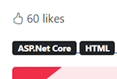
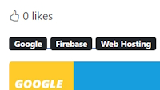
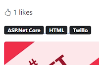
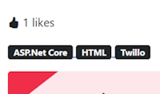
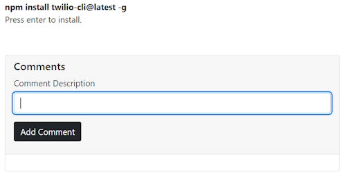
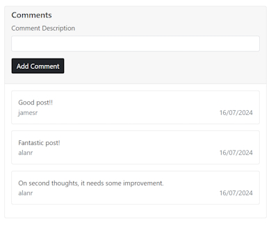

# Adding User Functionality with Likes and Comments

## Domain Model for Blog Post Likes

Create a new Domain Model named ``BlogPostLike``.

```bash
    public class BlogPostLike
    {
        public int Id { get; set; }
        public int BlogPostId { get; set; }
        public int UserId { get; set; }
    }
```

In the ``BlogPost`` Domain Model add a new navigation property.

```bash
    public ICollection<BlogPostLike> Likes { get; set; }
```

In The ``BlogDbContext.cs`` file add.

```bash
    public DbSet<BlogPostLike> BlogPostLike { get; set; }
```

Do a new migration.

> Add-Migration "Add BlogPostLike domain model." -Context BlogDbContext

Now create the Likes table in the database.

> Update-Database -Context BlogDbContext

## Implement the total Likes on Blog Details

Install Bootstrap icons.
[Get bootstrap Icons](https://icons.getbootstrap.com/#install)

Add the CDN link to our ``_Layout.cshtml`` page in the header section.

```bash
<link rel="stylesheet" href="https://cdn.jsdelivr.net/npm/bootstrap-icons@1.11.3/font/bootstrap-icons.min.css">
```

We want to use a thumbs up icon on our ``Details`` page. Find it on the Icons main page.

```bash
    <i class="bi bi-hand-thumbs-up"></i>
```

Add it to a new Div on our page. We will add a number of likes.

```bash
    <div class="mb-3">
        <span><i class="bi bi-hand-thumbs-up"></i> 60 likes</span>
    </div>
```

It looks like this.



There are a number of things we need to do.

* Make the icon into a workable button to collect the ``click`` event.
* Get the number of likes from the database
* Save the collected like to the database

Now in the Code Behind class we will get the number of likes for an article from the database. First we need to create a ``IBlogPostLikeRepository`` interface in the Repository and an implementation class ``LikeRepository``.

Add our first method into our ``IBlogPostLikeRepository`` interface.

```bash
    public interface IBlogPostLikeRepository
    {
        Task<int> GetPostTotalLikes(int blogPostId);
    }
```

Create an implementation of our interface method.

We also need a context to the database and to inject the services into our application.

In ``Program.cs`` add.

```bash
    builder.Services.AddScoped<IBlogPostLikeRepository, BlogPostLikeRepository>();
```

Add your context to the ``BlogPostLikeRepository`` constructor and create your method implementation.

```bash
    private readonly BlogDbContext blogDbContext;

    public BlogPostLikeRepository(BlogDbContext blogDbContext)
    {
        this.blogDbContext = blogDbContext;
    }

    public async Task<int> GetTotalLikesForBlog(int blogPostId)
    {
        return await blogDbContext.BlogPostLike.CountAsync(x => x.BlogPostId == blogPostId);
    }
```

We can now use this repository in our ``BlogPage/Details`` Code Behind class.

Inject the ``IBlogPostLikeRepository`` into our constructor. Add the number of likes for our Blog Post in the ``OnGet()`` method.

Create a new public property to store the likes named ``TotalLikes``.

### BlogPage/Details.cshtml.cs

```bash
private readonly IBlogPostRepository blogPostRepository;
private readonly IBlogPostLikeRepository blogPostLikeRepository;

public int TotalLikes { get; set; }
public BlogPost BlogPost { get; set; }

public DetailsModel(IBlogPostRepository blogPostRepository, IBlogPostLikeRepository blogPostLikeRepository)
{
    this.blogPostRepository = blogPostRepository;
    this.blogPostLikeRepository = blogPostLikeRepository;
}

public async Task<IActionResult> OnGet(string urlHandle)
{
    BlogPost = await blogPostRepository.GetAsync(urlHandle);

    if (BlogPost != null) 
    {
        TotalLikes = await likeRepository.GetPostTotalLikes(BlogPost.Id);
    }
    
    return Page();
}
```

We can now use ``TotalLikes`` in our ``Details`` page.

```bash
    <span><i class="bi bi-hand-thumbs-up"></i> @Model.TotalLikes likes</span>
```

This should give us the total number of likes which will be 0 because we haven't added any likes yet.



## Adding a like to a Blog Post

We will add an anchor element as a button to our like span.

```bash
    <span>
        <a id="btnLike" style="cursor: pointer">
            <i class="bi bi-hand-thumbs-up"></i>
        </a>
        @Model.TotalLikes likes
    </span>
```

Now we can add some JavaScript to save the ``click`` event to write the result to our database. To do this we will create a new Controller named ``BlogPostLikeController``. We will also create a new ViewModel named ``AddLike``.

### ViewModel/AddBlogPostLikeRequest.cs

```bash
    public int BlogPostId { get; set; }
    public Guid UserId { get; set; }
```

### BlogPostLikeController.cs

Add an ``ApiController`` attribute to state that this Controller doesn't have any views.

Add a route for ``api/blogpostlike``.

```bash
    [ApiController]
    [Route("api/[controller]")]
    public class BlogPostLikeController : Controller
    {
        [Route("Add")]
        [HttpPost]
        public Task<IActionResult> AddLike([FromBody] AddLike addLike)
        {

        }
    }
```

After doing this our route will be, ``api/blogpostlike/add``.

At this stage we will have to add a new method named ``AddLikeForBlog`` to our ``BlogPostLikeRepository``.

```bash
    public async Task AddLikeForBlog(int blogPostId, Guid userId)
    {
        var like = new BlogPostLike
        {
            BlogPostId = blogPostId,
            UserId = userId
        };

        await blogDbContext.BlogPostLike.AddAsync(like);
        await blogDbContext.SaveChangesAsync();
    }
```

Use this method in ``BlogPostLikeController``.

```bash
    [Route("Add")]
    [HttpPost]
    public async Task<IActionResult> AddLike([FromBody] AddBlogPostLikeRequest addLike)
    {
        await likeRepository.AddLikeForBlog(addLike.BlogPostId, addLike.UserId);

        return Ok();
    }
```

We are now at the stage of writing JavaScript using a ``Fetch`` command to add our Like to the database.

Our thumb icon has a button click with an Id of ``btnLike``. We create an ``addEventListener`` to capture this click.

Getting the ``BlogPostId`` is easy as it comes from our model.

To get the ``userId`` we have to inject the UserManager from Identity. We can do this by adding the following into ``Details.cshtml``.

```bash
    @using Microsoft.AspNetCore.Identity
    @inject UserManager<IdentityUser> userManager
```

This is the JavaScript we need to add a Like.

```bash
@section Scripts {
<script>
    const btnLike = document.getElementById('btnLike');

    async function addLikeForBlog() {
        console.log(`blogPostId: {@Model.BlogPost.Id}`);
        console.log(`userId: {@userManager.GetUserId(User)}`);

        fetch('/api/blogpostlike/add', {
            method: 'POST',
            headers: {
                'Content-Type': 'application/json',
                'Accept': '*/*'
            },
            body: JSON.stringify({ blogPostId: '@Model.BlogPost.Id', userId: '@userManager.GetUserId(User)' })
        })
            .then(console.log('Request finished.'));
    }

    btnLike.addEventListener('click', addLikeForBlog);

</script>
}
```

We are now ready to test that we can add a button click into the ``BlogPostLike`` table.

Once we click it won't update the counter but if you refresh the page it will work. We'll fix this next.



## More functionality for the Like button

First delete all records in the ``BlogPostLike`` table. We want to get rid of duplicates.

Add a Like to the first Blog Post.

Now we will write code to stop duplicates.

In the ``BlogPostLikeController.cs`` controller add.

```bash
    [HttpGet]
    [Route("{blogPostId:int}/totalLikes")]
    public async Task<IActionResult> GetTotalLikes([FromRoute] int BlogPostId)
    {
        var totalLikes = await likeRepository.GetTotalLikesForBlog(BlogPostId);

        return Ok(totalLikes);
    }
```

The ``GetTotalLikesForBlog()`` repository method already exists.

Now in ``Details.cshtml`` we will modify the JavaScript code.

Change the ``.then()`` code to

```bash
    .then(() => {
        btnLike.innerHTML = '<i class="bi bi-hand-thumbs-up-fill"></i>';
        btnLike.removeEventListener('click', addLikeForBlog);
        getTotalLikes();
    });
```

**Note:** we will write ``getTotalLikes()`` next.

The ``.innerHTML`` statement makes the thumbs up full colour. The next line removes the ``addLikeForBlog`` so that the user can't click twice on adding a like.

We now need to get the total Blog Post likes so we need to create another JavaScript function named ``getTotalLikes()``  to retrieve the likes from the Controller method that we just created.

```bash
    const totalLikesElement = document.getElementById('totalLikes');

    async function getTotalLikes() {
        fetch('/api/blogpostlike/@Model.BlogPost.Id/totallikes', {
            method: 'GET',
            headers: {
                'Content-Type': 'application/json',
                'Accept': '*/*'
            }
        })
            .then(data => data.json())
            .then(result => totalLikesElement.innerHTML = result);
    }
```

Change the ``Likes`` Div to.

```bash
    <div class="mb-3">
        <span>
            <a id="btnLike" style="cursor: pointer">
                <i class="bi bi-hand-thumbs-up"></i>
            </a>

            <span id="totalLikes">@Model.TotalLikes</span> likes
        </span>
    </di
```

And we are ready to test.

Select the first Blog Post (This will have 1 like). Click on like again.



You will notice that the like button has been coloured and it has updated the like count to the total likes. If we clicked on the like button again it won't register another like. 

If we refreshed the page it will register another like. We will make changes to stop this.

Create a new method in the ``BlogPostLikeRepository`` to get a list of Likes for a ``BlogPostId``.

```bash
public async Task<IEnumerable<BlogPostLike>> GetLikesForBlog(int blogPostId)
{
    return await blogDbContext.BlogPostLike.Where(x => x.BlogPostId == blogPostId).ToListAsync();
}
```

This will give us a list of Likes for the particular ``BlogPostId``. We can use this in our ``Details`` Code Behind class to see if the user has already liked that Blog Post.

In ``Details.cshtml.cs`` add the ``SignInManager`` and ``UserManager`` Identity services.

```bash
    private readonly SignInManager<IdentityUser> signInManager;
    private readonly UserManager<IdentityUser> userManager;
```

In the ``OnGet()`` method.

```bash
    if (BlogPost != null)
    {
        if (signInManager.IsSignedIn(User))
        {
            var likes = await likeRepository.GetLikesForBlog(BlogPost.Id);
    
            var userId = userManager.GetUserId(User);
    
            Liked = likes.Any(x => x.UserId == Guid.Parse(userId)); 
        }
    
        TotalLikes = await likeRepository.GetTotalLikesForBlog(BlogPost.Id);
    }
```

First, only signed in users will be able to Like a Blog Post.

Then we get a list of Likes for a Blog Post. Next we get the ``userId`` for the signed in user.

We then check to see if the userId is in the list of Likes. We create a boolean property named ``Liked`` that records the result.

In the ``Details`` Razor page inject the ``SignInManager`` and ``UserManager`` services.

```bash
    @inject UserManager<IdentityUser> userManager
    @inject SignInManager<IdentityUser> signInManager
```

Change the code in the Likes Div.

```bash
    <div class="mb-3">
        <span>
            @if (signInManager.IsSignedIn(User))
            {
                @if (Model.Liked)
                {
                    <a style="cursor: pointer">
                        <i class="bi bi-hand-thumbs-up-fill"></i>
                    </a>
                }
                else
                {
                    <a id="btnLike" style="cursor: pointer">
                        <i class="bi bi-hand-thumbs-up"></i>
                    </a>
                }

            }
            <span id="totalLikes">@Model.TotalLikes</span> likes
        </span>
    </div>
```

Inside the span we will check if the user is signed in. If they aren't then they won't see the thumbs up icon so can't like the Blog Post. They will see the number of Likes count.

If you are signed in the thumbs up icon will appear. If you have already liked this post you will see a black thumb else you will be able to like the post.

## Create Domain Model for Blog Post comments

In ``Models/Domain`` add the ``BlogPostComment`` model.

```bash
    public class BlogPostComment
    {
        public Guid Id { get; set; }

        public string Description { get; set; }

        public Guid BlogPostId { get; set; }

        public Guid UserId { get; set; }

        public DateTime DateAdded { get; set; }
    }
```

In the Domain/Model ``BlogPost`` model add an ICollection for ``BlogPostComment``.

```bash
    public ICollection<BlogPostComment> Comments { get; set; }
```

In the ``BlogDbContext`` add a DBSet.

```bash
    public DbSet<BlogPostComment> BlogPostComment {  get; set; } 
```

Compile your application and do the migration

> Add-Migration "Add BlogPostComment domain model." -Context BlogDbContext

Now update the database.

> Update-Database -Context BlogDbContext

You should have a new table named ``BlogPostComment`` in your Blog database.

Now we will add a ``Comment`` section into our ``BlogPage/Details`` Razor page below the ``Content`` section.

```bash
<div class="card">
    <div class="card-header">
        <h5>Comments</h5>

        @if (signInManager.IsSignedIn(User))
        {
            <form method="post">
                <div class="mb-3">
                    <label class="form-label">Comment Description</label>
                    <input type="text" class="form-control" />
                </div>
                <div class="mb-3">
                    <button type="submit" class="btn btn-dark">Add Comment</button>
                    <input type="hidden" asp-for="BlogPostId" />
                </div>
            </form>
        }
    </div>
    <div class="card-body">

    </div>
</div>
```

We have to be logged in to leave a comment. Run the application to test the comment section.



Now we can add the functionality to get the Comments section working. We'll do this by adding an ``OnPost()`` method.

```bash
    public async Task<IActionResult> OnPost()
    {

    }
```

Before we can complete this we will have to add a new Interface class named ``IBlogPostCommentRepository`` and its implementation class.

```bash
    public async Task<BlogPostComment> AddComment(BlogPostComment blogPostComment)
    {
        await blogDbContext.BlogPostComment.AddAsync(blogPostComment);
        await blogDbContext.SaveChangesAsync();

        return blogPostComment;
    }
```

This saves the comment to the database.

Before we can use this repository we have to inject the service into the application.

```bash
    builder.Services.AddScoped<IBlogPostCommentRepository, BlogPostCommentRepository>();
```

Now back in ``Details.cshtml.cs``.

Inject the ``IBlogPostCommentRepository`` service into the constructor and create a private field named ``commentRepository``.

Create a new property.

```bash
    [BindProperty]
    public int BlogPostId { get; set; }
```

This has to have a two-way binding because we need to use this Id in the ``OnGet()`` method and the ``OnPost()`` method.

In the ``OnGet()`` method we have to give ``BlogPostId`` a value.

```bash
    if (BlogPost != null)
    {
        BlogPostId = BlogPost.Id;

        if (signInManager.IsSignedIn(User))
        {
            var likes = await likeRepository.GetLikesForBlog(BlogPostId);

            var userId = userManager.GetUserId(User);

            Liked = likes.Any(x => x.UserId == Guid.Parse(userId)); 
        }


        TotalLikes = await likeRepository.GetTotalLikesForBlog(BlogPostId);
    }
```

We will also change ``BlogPost.Id`` to ``BlogPostId`` in this section.

We will also save the ``BlogPostId`` value as a hidden value in the Post Form section of our ``Details`` Razor page.

```bash
    <form method="post">
        <div class="mb-3">
            <label class="form-label">Comment Description</label>
            <input type="text" class="form-control" asp-for="CommentDescription" />
        </div>
        <div class="mb-3">
            <button type="submit" class="btn btn-dark">Add Comment</button>
            <input type="hidden" asp-for="BlogPostId" />
        </div>
    </form>
```

Create a new property named ``CommentDescription``.

```bash
    [BindProperty]
    public string CommentDescription { get; set; }
```

We will add this to the Form for the Comment Description input value.

```bash
    <label class="form-label">Comment Description</label>
    <input type="text" class="form-control" asp-for="CommentDescription" />
```

We can now finish the ``OnPost()`` method.

```bash
public async Task<IActionResult> OnPost(string urlHandle)
{
    if (signInManager.IsSignedIn(User) && !string.IsNullOrWhiteSpace(CommentDescription))
    {
        var userId = userManager.GetUserId(User);

        var comment = new BlogPostComment()
        {
            BlogPostId = BlogPostId,
            Description = CommentDescription,
            DateAdded = DateTime.Now,
            UserId = Guid.Parse(userId)
        };

        await commentRepository.AddComment(comment);
    }

    return RedirectToPage("BlogPage/Details", new { urlHandle = urlHandle });
}
```

The important part here is that we need to passing as a parameter the string ``urlHandle``. This allows us to redirect back to the ``OnGet()`` method so that we can re-get the Blog Post and the Likes values to rebuild the Details page.

This process is a design pattern called ``POST-REDIRECT-GET``(PRG).

The user has to be logged in because we need the ``UserId`` when we post the comments to the database.

**Note:** I made a mistake in this code which compiled but failed in runtime. I had ``BlogPostId = BlogPost.Id`` when ``BlogPost.Id`` didn't exist in the ``OnPost()`` method. I had a 2 way bindable ``BlogPostId`` property that I should have been using instead.

## Displaying the Comments

we need to create a new method in the ``BlogPostCommentRepository`` to get a list of comments for a Blog Post.

```bash
public async Task<IEnumerable<BlogPostComment>> GetComments(int blogPostId)
{
    return await blogDbContext.BlogPostComment.Where(x => x.BlogPostId == blogPostId).ToListAsync();
}
```

Now we can use this method in the ``OnGet()`` method of the ``Details.cshtml.cs`` class.

In the ``signInManager.IsSignedIn(User)`` **if** statement we can get the comments.

```bash
    Comments = await commentRepository.GetComments(BlogPostId);
```

We need to create a new ``Comments`` List property to use the comments on the ``Details`` Razor page.

We can't use the ``BlogPostComment`` Domain model for this because we need to use the userId to find the user name for display. We can create a new View Model named ``BlogComment``.

```bash
    public class BlogComment
    {
        public string Description { get; set; }
        public DateTime DateAdded { get; set; }
        public string Username { get; set; }
    }
```

This model uses the ``Username`` instead of the ``UserId`` and allows us to use the name of the person who created the comment.

Create a private method in ``Details.cshtml.cs`` named ``GetComments()``.

```bash
private async Task GetComments()
{
    var blogPostComments = await commentRepository.GetComments(BlogPost.Id);

    var blogCommentsViewModel = new List<BlogComment>();

    foreach (var comment in blogPostComments)
    {
        blogCommentsViewModel.Add(new BlogComment
        {
            DateAdded = comment.DateAdded,
            Description = comment.Description,
            Username = (await userManager.FindByIdAsync(comment.UserId.ToString())).UserName
        });
    }

    Comments = blogCommentsViewModel;
}
```

This gets the comments from the ``BlogPostComment`` list and adds them to a ``BlogComment`` list.

Now fill in the ``card-body`` Div.

```bash
<div class="card-body">
    @if (Model.Comments != null && Model.Comments.Any())
    {
        @foreach (var comment in Model.Comments)
        {
            <div class="card mb-3">
                <div class="card-body">
                    <div>
                        @comment.Description
                    </div>
                    <div class="d-flex justify-content-between">
                        <span class="text-secondary">@comment.Username</span>
                        <span class="text-secondary">@comment.DateAdded.ToShortDateString()</span>
                    </div>
                </div>
            </div>
        }
    }
    else
    {
        <p>No comments.</p>
    }
</div>
```

In the ``OnGet()`` method add a call to ``GetComments()`` inside the **signInManager** section of the ``if`` block.

```bash
    if (signInManager.IsSignedIn(User))
    {
        var likes = await likeRepository.GetLikesForBlog(BlogPostId);

        var userId = userManager.GetUserId(User);

        Liked = likes.Any(x => x.UserId == Guid.Parse(userId));

        await GetComments();
    }
```

This will show a list of Comments if they exist.

Test this out.



If you add a new comment it will resend the page and show the new comment.

## Added notes for Removing the last Migration

When I added the ``Like`` migration I made a mistake with the migration. I wasn't sure on how I could recover from this issue but it turned out to be fairly simple.

In the list of migrations there was a class named similar to this.

> 20240713051234_Add Like domain model.cs

This class was created after I ran the migration and updated the database.

There is another class in this folder named ``BlogDbContextModelSnapshot.cs``.

This class keeps a list of all of the models you have created.

It created an Entity.

```bash
modelBuilder.Entity("Blog.Models.Domain.Like", b =>
    {
        b.Property<int>("Id")
            .ValueGeneratedOnAdd()
            .HasColumnType("int");

        SqlServerPropertyBuilderExtensions.UseIdentityColumn(b.Property<int>("Id"));

        b.Property<int>("BlogPostId")
            .HasColumnType("int");

        b.Property<Guid>("UserId")
            .HasColumnType("int");

        b.HasKey("Id");

        b.HasIndex("BlogPostId");

        b.ToTable("BlogPostLike");
    });
```

And another Entity.

```bash
modelBuilder.Entity("Blog.Models.Domain.Like", b =>
    {
        b.HasOne("Blog.Models.Domain.BlogPost", null)
            .WithMany("Likes")
            .HasForeignKey("BlogPostId")
            .OnDelete(DeleteBehavior.Cascade)
            .IsRequired();
    });
```

The database Table, ``Like`` was also created after we ran the ``Update-Database`` command.

### Rolling back the last Migration

To gracefully rollback I found that you could delete ``20240713051234_Add Like domain model.cs``.

Also delete the Table ``Like`` in the database.

Now you can run this command to remove the migration.

```bash
    Remove-Migration -Context BlogDbContext
```

This will remove the last migration and if you look in ``BlogDbContextModelSnapshot.cs`` you will see that the last 2 Entities that were described above have been removed.

Now you can fix your Model by renaming it to ``BlogPostLike.cs``. Change the fields to what you want.

Make sure to change the ``BlogPost`` Navigation link to.

```bash
    public ICollection<BlogPostLike> Likes { get; set; }
```

Change the ``BlogDbContext`` to.

```bash
    public DbSet<BlogPostComment> BlogPostComment {  get; set; }
```

Now you are ready to do the revised ``Add-Migration``.

> Add-Migration "Add BlogPostLike domain model." -Context BlogDbContext

Update the database.

> Update-Database -Context BlogDbContext

Now you should see the ``BlogPostLike`` table in the database. Look at your ``BlogDbContextModelSnapshot.cs`` and  you should see the 2 new Entities that you just created.

```bash
    modelBuilder.Entity("Blog.Models.Domain.BlogPostLike", b =>
    ...
```

And.

```bash
    modelBuilder.Entity("Blog.Models.Domain.BlogPostLike", b =>
        {
            b.HasOne("Blog.Models.Domain.BlogPost", null)
                .WithMany("Likes")
                .HasForeignKey("BlogPostId")
                .OnDelete(DeleteBehavior.Cascade)
                .IsRequired();
        });
```

Now your ``BlogDbContext`` will be working properly.
