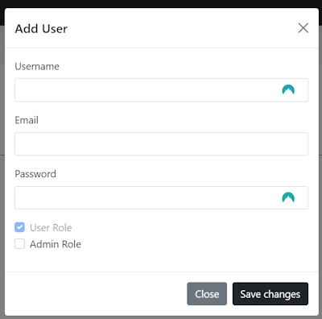
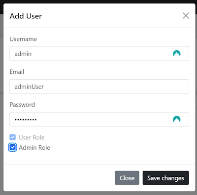
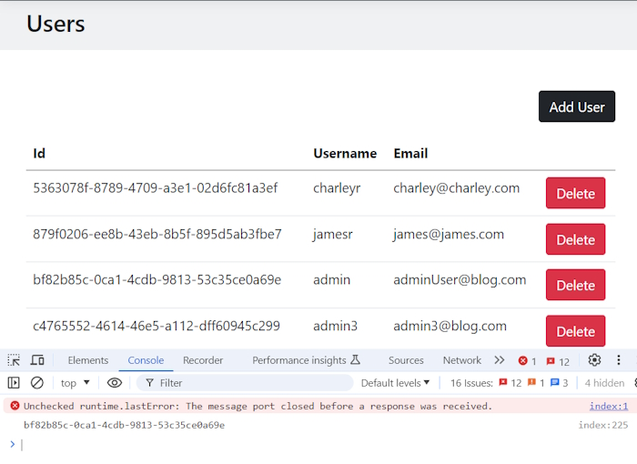

# Admin User functionality management

## Display Users (list all users)

Add a new folder in ``Admin`` named ``Users``.

Add a new Razor page named ``Index.cshtml``. Give the page a header.

```bash
    <div class="bg-secondary bg-opacity-10 py-2 mb-5">
        <div class="container">
            <h2>Users</h2>
        </div>
    </div>
```

We want to get a list of all Users. To do this create a new ``IUserRepository`` and an implementation.

```bash
public async Task<IEnumerable<IdentityUser>> GetAll()
{
    var users = await authDbContext.Users.ToListAsync();

    var superAdminUser = await authDbContext.Users.FirstOrDefaultAsync(x => x.Email == "superadmin@blog.com");

    if (superAdminUser != null) 
    {
        users.Remove(superAdminUser);
    }

    return users;
}
```

We remove the ``superAdminUser`` account from our list.

Inject the service into our application. In ``Program.cs``.

```bash
    builder.Services.AddScoped<IUserRepository, UserRepository>();
```

 Now we can use our method in the ``OnGet()`` method in the ``Index`` Code Behind class.

 ```bash
    public async Task OnGet()
    {
        var users = await userRepository.GetAll();
    }
 ```

 These ``users`` are ``Identity`` users so aren't in a format that we can use. To get around this we will create a new  ViewModel named ``User``.

 ```bash
    public class User
    {
        public Guid Id { get; set; }
        public string Username { get; set; }
        public string Email { get; set; }
    }
 ```

Create an ``OnGet()`` method in the ``Index.cshtml.cs`` class.

```bash
    public async Task<IActionResult> OnGet()
    {
        var users = await userRepository.GetAll();

        Users = new List<User>();

        foreach (var user in users) 
        {
            Users.Add(new Models.ViewModels.User()
            {
                Id = Guid.Parse(user.Id),
                Username = user.UserName,
                Email = user.Email
            });
        };

        return Page();
    }
```
 
### Index.cshtml

Create a basic list table.

```bash
    <div class="bg-secondary bg-opacity-10 py-2 mb-5">
        <div class="container">
            <h2>Users</h2>
        </div>
    </div>

    <div>
        <div class="container">
            <table class="table">
                <thead>
                    <tr>
                        <th>Id</th>
                        <th>Username</th>
                        <th>Email</th>
                        <th> </th>
                    </tr>
                </thead>
                <tbody>
                    @foreach (var user in Model.Users)
                    {
                        <tr>
                            <td>@user.Id</td>
                            <td>@user.Username</td>
                            <td>@user.Email</td>
                            <td>
                            </td>
                        </tr>
                    }
                </tbody>
            </table>
        </div>
    </div>
```

## Create an Add User Model Popup dialog and Add User Functionality

To create a Modal dialog box we will use the Bootstrap Modal form.

[Bootstrap Modal dialog box](https://getbootstrap.com/docs/5.3/components/modal/)

Just above the Table add a new Div for an Add User button.

```bash
    <div class="mb-3 d-flex justify-content-end">
        <!-- Button trigger modal -->
        <button type="button" class="btn btn-dark"
                data-bs-toggle="modal" data-bs-target="#addUserModal">
            Add User
        </button>
    </div>
```

Our modal form will be added to the bottom of the page.

```bash
<form method="post">
    <!-- Modal -->
    <div class="modal fade" id="addUserModal" tabindex="-1" aria-labelledby="exampleModalLabel" aria-hidden="true">
        <div class="modal-dialog">
            <div class="modal-content">
                <div class="modal-header">
                    <h5 class="modal-title" id="exampleModalLabel">Add User</h5>
                    <button type="button" class="btn-close" data-bs-dismiss="modal" aria-label="Close"></button>
                </div>
                <div class="modal-body">
                    <div class="mb-3">
                        <label class="form-label">Username</label>
                        <input type="text" class="form-control"
                               required />
                    </div>
                    <div class="mb-3">
                        <label class="form-label">Email</label>
                        <input type="email" class="form-control"
                               required />
                    </div>
                    <div class="mb-3">
                        <label class="form-label">Password</label>
                        <input type="password" class="form-control"
                               required minlength="6" />
                    </div>
                    <div class="mb-3">
                        <div class="form-check">
                            <input class="form-check-input" type="checkbox"
                                   value="User" checked disabled>
                            <label class="form-check-label" for="flexCheckDefault">
                                User Role
                            </label>
                        </div>

                        @if (User.IsInRole("SuperAdmin"))
                        {
                            <div class="form-check">
                                <input class="form-check-input" type="checkbox" />
                                <label class="form-check-label" for="flexCheckChecked">
                                    Admin Role
                                </label>
                            </div>
                        }
                    </div>
                </div>
                <div class="modal-footer">
                    <button type="button" class="btn btn-secondary" data-bs-dismiss="modal">Close</button>
                    <button type="submit" class="btn btn-dark">Save changes</button>
                </div>
            </div>
        </div>
    </div>
</form>
```

Test the page.



Now we are ready to bind the form fields so that we can add them to the database.

Go back to the Code Behind class but first we will create a new ViewModel to save the User data.

```bash
    public class AddUser
    {
        public string Username { get; set; }

        public string Email { get; set; }

        public string Password { get; set; }

        public bool AdminCheckbox { get; set; }
    }
```

Create a new user property to save the User details. Make it two way binding so we can return values from the Razor page to the Code Behind class.

```bash
    [BindProperty]
    public AddUser AddUserRequest { get; set; }
```
 
Now on the ``Index`` page add the ``asp-for`` values.

```bash
<div class="modal-body">
    <div class="mb-3">
        <label class="form-label">Username</label>
        <input type="text" class="form-control"
               asp-for="AddUserRequest.Username" required />
    </div>
    <div class="mb-3">
        <label class="form-label">Email</label>
        <input type="email" class="form-control"
               asp-for="AddUserRequest.Email" required />
    </div>
    <div class="mb-3">
        <label class="form-label">Password</label>
        <input type="password" class="form-control"
               asp-for="AddUserRequest.Password" required minlength="6" />
    </div>
    <div class="mb-3">
        <div class="form-check">
            <input class="form-check-input" type="checkbox"
                   value="User" checked disabled asp-for="AddUserRequest.AdminCheckbox">
            <label class="form-check-label" for="flexCheckDefault">
                User Role
            </label>
        </div>

        <div class="form-check">
            <input class="form-check-input" type="checkbox" />
            <label class="form-check-label" for="flexCheckChecked">
                Admin Role
            </label>
        </div>
    </div>
</div>
```

Once we do this we can create a new method in the ``UserRepository()`` class.

```bash
    public async Task<bool> AddUser(IdentityUser identityUser, string password, List<string> roles)
    {
        var identityResult = await userManager.CreateAsync(identityUser, password);

        if (identityResult.Succeeded) 
        {
            identityResult = await userManager.AddToRolesAsync(identityUser, roles);

            if (identityResult.Succeeded)
            { 
                return true;
            }
        }

        return false;
    }
```

Now we can create an ``OnPost()`` method in the ``Index`` Code Behind class to save the user.

```bash
    public async Task<IActionResult> OnPost()
    {
        var identityUser = new IdentityUser 
        {
            UserName = AddUserRequest.Username,
            Email = AddUserRequest.Email
        };
    
        var roles = new List<string> { "User" };
    
        if (AddUserRequest.AdminCheckbox)
        {
            roles.Add("Admin");
        }
    
        var result = await userRepository.AddUser(identityUser, AddUserRequest.Password, roles);
    
        if (result)
        {
            return RedirectToPage("/Admin/Users/Index");
        }
    
        return Page();
    } 
```

We are now ready to save a new user into the database.

Change the Admin navigation in the ``_Layout.cshtml`` page.

```bash
<ul class="dropdown-menu">
    <li>BLOGS</li>
    <li>
        <a class="dropdown-item" href="/admin/blogs/add">Add Blog Post</a>
    </li>
    <li>
        <a class="dropdown-item" href="/admin/blogs/list">List Blog Posts</a>
    </li>
    <li><hr class="dropdown-divider"></li>
    <li>USERS</li>
    <li>
        <a class="dropdown-item" href="/admin/users/index">Users</a>
    </li>
</ul>
```

If we create a new ``Admin`` account they will be able to add a new ``User``. 

Create a new ``Admin`` account using SuperUserAdmin.



Now log in as the admin user. This Admin user has the ability to make a new user and make that user an Admin.

This is not what we want. We have to block the option where the Admin account is able to create an Admin user. Only the SuperAdmin user should be able to do this. We can do this with.

```bash
@if (User.IsInRole("SuperAdmin"))
{
    <div class="form-check">
        <input class="form-check-input" type="checkbox" asp-for="AddUserRequest.AdminCheckbox" />
        <label class="form-check-label" for="flexCheckChecked">
            Admin Role
        </label>
    </div>
}
```

Now the Admin user won't see the Admin CheckBox.

## Delete User functionality

In the User table add a button to the end of every User record.

```bash
    <tbody>
        @foreach (var user in Model.Users)
        {
            <tr>
                <td>@user.Id</td>
                <td>@user.Username</td>
                <td>@user.Email</td>
                <td>
                    <a class="btn btn-danger user-delete-btn"
                       data-id="@user.Id">
                        Delete
                    </a>
                </td>
            </tr>
        }
    </tbody>
```

We will use this button to delete a User record. Now add JavaScript to the bottom of the page to do the deletion.

```bash
    @section Scripts {
    <script>
        const userDeleteElements = document.querySelectorAll('.user-delete-btn');
    
        userDeleteElements.forEach((element) => {

            element.addEventListener('click', function () {
                const userId = element.dataset.id;

                console.log(userId);
            });
        });
    </script>
```

Next we create a new ``Post()`` method named ``OnPostDelete()``

```bash
    public async Task<IActionResult> OnPostDelete()
    {
       return Page();
    }
```

Run this and you should see the ``userId`` of the User that you are about to delete.



You can see from the ``userId`` that I clicked on the UserName ``admin``. This shows that we are able to capture the current ``userId``.

We now need to collect the ``userId`` and pass it back to the Code Behind class.

To do this we will have to create another Form around the Table Div.

```bash
<form method="post" asp-page-handler="delete" id="deleteUserForm">
    <table class="table">
        <thead>
            <tr>
                <th>Id</th>
                <th>Username</th>
                <th>Email</th>
                <th> </th>
            </tr>
        </thead>
        <tbody>
            @foreach (var user in Model.Users)
            {
                <tr>
                    <td>@user.Id</td>
                    <td>@user.Username</td>
                    <td>@user.Email</td>
                    <td>
                        <a class="btn btn-danger user-delete-btn"
                           data-id="@user.Id">
                            Delete
                        </a>
                    </td>
                </tr>
            }
        </tbody>
    </table>
    <input type="hidden" asp-for="SelectedUserId" id="selectedUserId" />
</form>
```

We also add a hidden input field to grab the ``selectedUserId``.

In our Code Behind page create a bindable ``selectedUserId`` property.

```bash
    [BindProperty]
    public Guid SelectedUserId { get; set; }
```

In our JavaScript create another element to grab the ``selectedUserId``.

In our Form element add the ``delete`` handler and id, ``deleteUserForm``.

```bash
    <form method="post" asp-page-handler="delete" id="deleteUserForm">
```

Now update the JavaScript to get the ``selectedUserId``  and the ``deleteUserForm`` elements.

```bash
    @section Scripts {
        <script>
            const userDeleteElements = document.querySelectorAll('.user-delete-btn');
            const selectedUserIdElement = document.getElementById('selectedUserId');
            const deleteUserFormElement = document.getElementById('deleteUserForm');

            userDeleteElements.forEach((element) => {

                element.addEventListener('click', function () {
                    const userId = element.dataset.id;

                    selectedUserIdElement.value = userId;
                    deleteUserFormElement.submit();
                });
            });
        </script>
    }
```

Now that we have the ``userId`` we can work on creating a ``DeleteUser()`` method in the ``UserRepository`` class.

```bash
    public async Task DeleteUser(Guid userId)
    {
        var user = await userManager.FindByIdAsync(userId.ToString());

        if (user != null)
        {
            await userManager.DeleteAsync(user);
        }
    }
```

Use this in the ``Index`` Code Behind class.

```bash
    public async Task<IActionResult> OnPostDelete()
    {
        await userRepository.DeleteUser(SelectedUserId);
        return RedirectToPage("/Admin/Users/Index");
    }
```

You are now able to delete users from the User Index page.

We are just about finished with the User Admin but there is one other issue that we need to fix.

Log in as a standard user and navigate to [the Admin section](https://localhost:7100/admin/users/index).

As a standard user you can see this page and we need to stop that.

In the Index Code Behind class add the ``Authorize`` attribute.

```bash
    namespace Blog.Pages.Admin.Users
    {
        [Authorize(Roles = "Admin")]
        public class IndexModel : PageModel
        {
            ...
```

Restart the page and navigate to the Admin section. You should get this message.


## Edit a User record

I want to be able to edit a Users details and the only way you can do this using Identity is to delete the original record and create a new User record. This is because the database stores the password as a password hash value and we can't see or change this field.

### Edit.cshtml

```bash
@page "{id?}"
@model Blog.Pages.Admin.Users.EditModel
@{
}

<div class="bg-secondary bg-opacity-10 py-2 mb-5">
    <div class="container">
        <h1>Edit User</h1>
    </div>
</div>

@if (Model.EditUserRequest != null)
{
    <div>
        <div class="container">
            <form method="post">

                <div class="mb-3">
                    <label for="userName" class="form-label">User name</label>
                    <input type="text" class="form-control" id="userName" asp-for="EditUserRequest.Username">
                </div>

                <div class="mb-3">
                    <label for="password" class="form-label">Password</label>
                    <input type="text" class="form-control" id="password" asp-for="EditUserRequest.Password">
                </div>

                <div class="mb-3">
                    <label for="email" class="form-label">Email</label>
                    <input type="text" class="form-control" id="email" asp-for="EditUserRequest.Email">
                </div>

                <div class="mb-3">
                    <div class="form-check">
                        <input class="form-check-input" type="checkbox"
                               value="User" checked disabled asp-for="EditUserRequest.AdminCheckbox">
                        <label class="form-check-label" for="flexCheckDefault">
                            User Role
                        </label>
                    </div>

                    @if (User.IsInRole("SuperAdmin"))
                    {
                        <div class="form-check">
                            <input class="form-check-input" type="checkbox" asp-for="EditUserRequest.AdminCheckbox" />
                            <label class="form-check-label" for="flexCheckChecked">
                                Admin Role
                            </label>
                        </div>
                    }
                </div>

                <div class="mb-3 d-flex justify-content-between">
                    <button class="btn btn-primary" type="submit" asp-page-handler="Edit">Submit</button>
                    <td><a href="/Admin/Users/Index" class="btn btn-secondary">Users</a></td>
                </div>
                <input type="hidden" asp-for="SelectedUserId" id="selectedUserId" />
            </form>
        </div>

        <partial name="_Notification"></partial>
    </div>
}
else
{
    <div class="container">
        <p>User Not Found!</p>
    </div>
}
```

I use the ``Notification`` to alert the administrator that they need to fill in all fields.

### Edit.cshtml.cs

```bash
[Authorize(Roles = "Admin")]
public class EditModel : PageModel
{
    private readonly IUserRepository userRepository;

    public EditModel(IUserRepository userRepository)
    {
        this.userRepository = userRepository;
    }

    [BindProperty]
    public EditUser EditUserRequest { get; set; }

    [BindProperty]
    public string SelectedUserId { get; set; }

    public async Task<IActionResult> OnGet(string? id)
    {
        ViewData["Notification"] = new Notification
        {
            Type = Enums.NotificationType.Success,
            Message = "<strong>Please note:</strong> you must update all fields."
        };

        EditUserRequest = await userRepository.GetUser(id);
        SelectedUserId = EditUserRequest.Id;

        return Page();
    }

    public async Task<IActionResult> OnPostAsync()
    {
        if (!string.IsNullOrWhiteSpace(EditUserRequest.Password))
        {
            // create a new user
            Guid userId;
            if (Guid.TryParse(SelectedUserId, out userId))
            {
                await userRepository.DeleteUser(userId);
                SelectedUserId = null;

                var identityUser = new IdentityUser
                {
                    UserName = EditUserRequest.Username,
                    Email = EditUserRequest.Email
                };

                var roles = new List<string> { "User" };

                if (EditUserRequest.AdminCheckbox)
                {
                    roles.Add("Admin");
                }

                var result = await userRepository.AddUser(identityUser, EditUserRequest.Password, roles);
            }
        }

        return RedirectToPage("/Admin/users/Index");
    }
}
```
